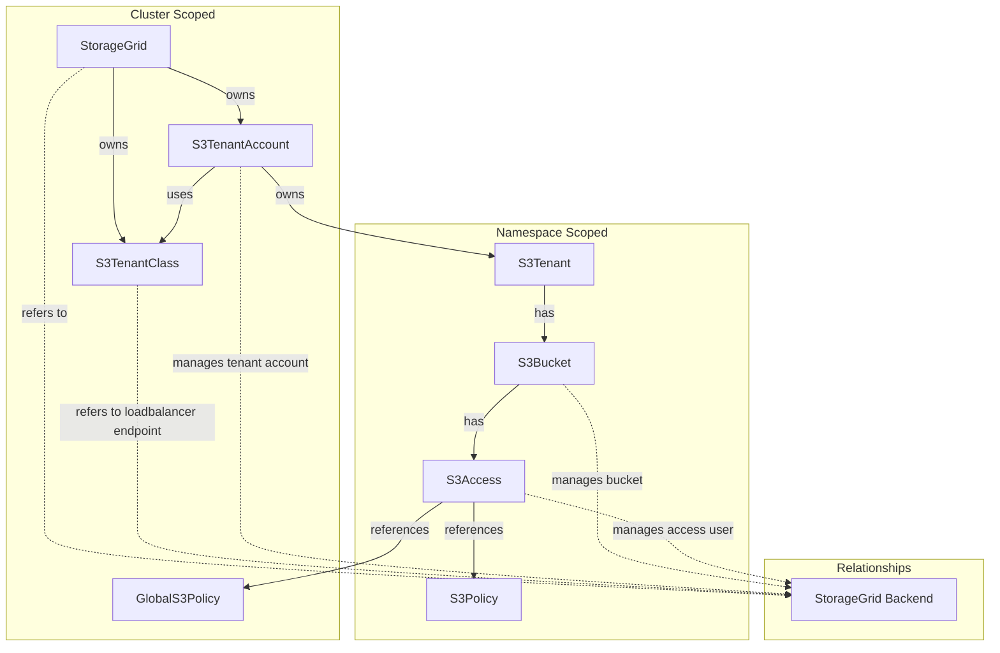

# StorageGrid Operator

A Kubernetes operator for managing NetApp StorageGrid S3 tenants and buckets as a native Kubernetes resource.

This operator is not created to manage your entire StorageGrid installation, but rather to provide a Kubernetes-native way to manage S3 resources on an existing StorageGrid backend.

## Overview

The StorageGrid Operator provides a Kubernetes-native way to manage S3 resources on NetApp StorageGrid. It allows you to define tenants, buckets, and configurations as Kubernetes custom resources, with the operator handling the lifecycle management and synchronization with the StorageGrid backend.

## Architecture



To better understand the architecture, please refer to the [Architecture Documentation](./docs/architecture/README.md).

## Custom Resources

This operator revolves around the following Custom Resource Definitions (CRDs):
* `StorageGrid`
* `S3TenantClass`
* `S3TenantAccount`
* `S3Tenant`
* `S3Bucket`
* `S3Access`
* `GlobalS3Policy`
* `S3Policy`

### StorageGrid
Cluster-scoped resource representing a StorageGrid installation. Manages connection credentials and global configuration.

Through this you can specify the endpoint as well as defaults for tenants referring to this StorageGrid. 

### S3TenantClass
Cluster-scoped resource defining S3 loadbalancer endpoint within your StorageGrid installation. Used by S3TenantAccounts to determine which endpoint to use.

This is similiar to an IngressClass in Kubernetes and always points to an existing loadbalancer endpoint in StorageGrid. Through the `spec.enforce` field you can enforce that tenants using this class will only be able to access the grid through this loadbalancer endpoint.

The operator automatically discovers all endpoints from the gateway's certificate SANs. You can control which endpoints are exposed to tenants using the `spec.preferredEndpoints` field:
- **Not set**: All discovered endpoints are exposed (default behavior)
- **Set with default + nil additionalEndpoints**: Default endpoint plus all discovered endpoints
- **Set with default + empty list `[]`**: Only the default endpoint is exposed
- **Set with default + explicit list**: Default endpoint plus only the specified endpoints

See more details on the official docs: https://docs.netapp.com/us-en/storagegrid-116/admin/configuring-load-balancer-endpoints.html 

### S3TenantAccount
Cluster-scoped resource representing the actual tenant account in StorageGrid backend. Manages the tenant lifecycle, credentials, and quotas.

You can imagine the `S3TenantAccount` somewhat similiar to a `PersistentVolume` in Kubernetes. It is a cluster-wide resource that provides the actual backend tenant account in StorageGrid. 

This resource in itself is not meant to be created directly, but rather through the `S3Tenant` resource. 

All interaction with the actual StorageGrid backend happens through this resource.

For more details on how the `S3TenantAccount` works, see the [tenant relationship](./docs/architecture/tenant-relationship.md).

### S3Tenant
Namespace-scoped resource providing a namespace-local view of a tenant. Creates and manages the underlying S3TenantAccount.

This then is the `PersistentVolumeClaim` equivalent in our analogy. It is a namespace-scoped resource that application teams can create to request a tenant account in StorageGrid. The operator will then create the corresponding `S3TenantAccount` in the cluster scope. 

### S3Bucket
Namespace-scoped resource for managing S3 buckets within a tenant. This is a basic interface to create and manage S3 buckets for your tenants and might be deprecated in the future in favor of more generic S3 operators. 

Currently it supports basic bucket CRUD operations as well as defining a policy that gets applied to the bucket.

## Features

- **Declarative Management**: Define S3 resources using Kubernetes manifests
- **Multi-Tenancy**: Support for multiple tenants with proper isolation
- **Quota Management**: Configure storage quotas per tenant
- **Credential Management**: Automatic generation and rotation of administrative and S3 credentials
- **Webhook Validation**: Built-in validation for resource configurations
- **Garbage Collection**: Proper cleanup cascade when resources are deleted
- **Metadata Enrichment**: As NetApp doesn't support tags on tenants, we enrich the tenant description with useful metadata such as the namespace, owner, and custom fields.
- **Event Observability**: Kubernetes events for state transitions, errors, and significant operations across all controllers

## Event Observability

The operator emits Kubernetes events for state transitions, errors, and significant operations across all controllers. Events provide a user-visible timeline of operations without requiring log access.

**Key characteristics:**
- 64 unique event types across 5 controllers
- Immediate emission for real-time visibility
- State-change emission to prevent spam
- Separate event streams per resource (no cross-resource propagation)

For detailed information on event architecture and implementation, see [Event Architecture](../docs/architecture/events.md).

### Critical Events

**S3 Endpoint Connectivity** - If bucket policy operations fail, check for:
- `S3EndpointConnectionFailed`: Cannot reach S3 loadbalancer endpoint
- `S3EndpointConnectionEstablished`: Connection successful

**Backend Connection** - For tenant operations:
- `BackendConnectionFailed`: Cannot reach StorageGrid management API
- `BackendConnectionRestored`: Management API connection restored

**Grid Health** - For overall grid status:
- `GridUnhealthy`: Too many unavailable nodes
- `GridHealthRecovered`: Grid has recovered

## Installation

### Prerequisites

- Kubernetes cluster (v1.20+)
- NetApp StorageGrid installation
- `kubectl` configured to access your cluster

### Required network access

The operator needs network access to the StorageGrid management endpoint as well as the S3 loadbalancer endpoints. Make sure that the cluster where the operator is running has access to these endpoints.

You can skip out on the S3 loadbalancer endpoints if you don't plan on using `spec.bucketPolicyJson`on your `S3Bucket` resource, but the management endpoint is required for all operations.

### Deploy the Operator

This operator is currently only provided as source. You can deploy it by cloning the repository and applying the manifests:

```bash
# Clone the repository
git clone https://github.com/bedag/storagegrid-operator.git
cd storagegrid-operator

# Deploy the operator
kubectl apply -f config/crd/bases/
kubectl apply -f config/rbac/
kubectl apply -f config/manager/
```

### Environment Variables

If you're not deploying the operator using the provided Kustomization, you can configure the operator using the following environment variables:

- `OPERATOR_NAMESPACE`: The namespace where the operator is running (defaults to `storagegrid-operator-system`)

## Usage

### 1. Create a StorageGrid Resource
Make sure to create your `Secret` containing the admin credentials for StorageGrid first.

```yaml
apiVersion: v1
kind: Secret
metadata:
  name: storagegrid-credentials
  namespace: storagegrid-operator-system
type: Opaque
data:
  username: <base64-encoded-username>
  password: <base64-encoded-password>
```

Then create the `StorageGrid` resource:

```yaml
apiVersion: s3.bedag.ch/v1alpha1
kind: StorageGrid
metadata:
  name: my-storagegrid
spec:
  endpoint: https://storagegrid.example.com
  credentialsSecret:
    name: storagegrid-credentials
    namespace: storagegrid-operator-system
```

### 2. Define an S3TenantClass

```yaml
apiVersion: s3.bedag.ch/v1alpha1
kind: S3TenantClass
metadata:
  name: default
spec:
  storageGridRef:
    name: my-storagegrid
  backingID: "gateway-endpoint-id" # check your storagegrid for the correct ID
  enforce: true
  
  # Optional: Control which endpoints are exposed to tenants
  # If not set, all discovered endpoints from the gateway certificate are exposed
  preferredEndpoints:
    defaultEndpoint: "s3.example.com"  # Primary endpoint (always exposed)
    # additionalEndpoints: []           # Empty list = only default endpoint
    # additionalEndpoints:              # Omit = all discovered endpoints
    #   - "s3-backup.example.com"       # Explicit list = only these + default
```

### 3. Create an S3Tenant

```yaml
apiVersion: s3.bedag.ch/v1alpha1
kind: S3Tenant
metadata:
  name: my-tenant
  namespace: default
spec:
  storageGridRef:
    name: my-storagegrid
  s3TenantClassName: default # or omit as it defaults to "default"
  description: "My application tenant"
  quota:
    limit: "100Gi"
  additionalTenantMetadata:
    project: "my-project"
    environment: "production"
    owner: "team-alpha"
```

#### Available Annotations
You can use the following annotations on the `S3Tenant` resource to modify its behavior:
```yaml
metadata:
  annotations:
    # Force recreation of S3 access keys on next reconciliation
    tenant.s3.bedag.ch/recreate-s3-access-keys: "true" 

    # Force deletion and recreation of the tenant on next reconciliation
    tenant.s3.bedag.ch/recreate-tenant: "true" 

    # As the change of the tenant class can lead to unexpected lose of access, this annotation must be set to allow the change of the tenant class.
    tenant.s3.bedag.ch/allow-tenant-class-name-change: "true" 

    # The tenant is protected from accidental deletion, setting this annotation to "true" will allow deletion of the tenant.
    tenant.s3.bedag.ch/allow-tenant-deletion: "true"
```

#### Secrets Created

When the `S3Tenant` is created, the operator will create multiple `Secrets` in the same namespace containing the S3 access credentials as well as the admin for the grid URL of the tenant. The secrets will be named `s3-tenant-<tenant-name>-s3-admin-keypair` and `s3-tenant-<tenant-name>-admin-credentials`.

These secrets can be used by your applications for administrative access to the tenant or for S3 access.

> [!NOTE]  
> Through setting the `spec.adminSecretRef` or `spec.s3AdminKeysSecretRef` fields on the `S3Tenant`, you can customize the names of these secrets. On existing secrets, the operator will remove the old ones and create the new ones.

#### How does the operator manage tenants?

When you create an `S3Tenant`, the operator can either:
1. **Create a new S3TenantAccount** automatically (default behavior)
2. **Claim an existing S3TenantAccount** using `spec.s3TenantAccountRef` (see Claiming section below)

The `S3TenantAccount` manages the actual tenant account in StorageGrid and handles all interactions with the backend. It stores the root credentials in a `Secret` in the `storagegrid-operator-system` namespace, named `s3-tenant-<tenant-name>-root-credentials`.

On the `S3TenantAccount` you can additionally set the `admin.s3.bedag.ch/reset-admin-password` annotation to force a reset of the admin password on the next reconciliation.

#### Tenant Deletion Policies

The `S3TenantAccount` supports deletion policies (configured via `status.tenantDeletionPolicy`) that control what happens to the StorageGrid tenant when the S3Tenant is deleted:

- **`Delete`**: Completely removes the tenant from StorageGrid backend (default for new accounts)
- **`Retain`**: Unbinds the S3Tenant but keeps the S3TenantAccount available for re-claiming. The account emits events and conditions to indicate it was retained. Transitions back to `PhaseReady`.
- **`RetainThenDelete`**: Retains for a configured duration, then deletes

**When using `Retain` policy for claimed accounts:**
1. The S3Tenant is deleted
2. The S3TenantAccount's `spec.s3TenantRef` is cleared (unbinding)
3. The account is reset to PhaseReady
4. The account becomes available for claiming by a new S3Tenant
5. Operator-managed secrets remain intact (unlike full tenant deletion)
6. The tenant in StorageGrid continues operating normally

This enables workflows like:
- Safely testing tenant claiming without risk of data loss
- Moving S3Tenant resources between namespaces while keeping the same backend account
- Temporarily removing namespace-scoped access while preserving the account
- Re-binding accounts to different S3Tenant resources

**When using `Retain` policy for imported accounts:**
1. Removes all operator-managed secrets (root, admin, S3 keys)
2. Clears ownership metadata (`managed_by`, `cr_uid`, `cr_name`, `kubernetes_namespace`) from the tenant description
3. Preserves user-provided description and custom metadata fields
4. Leaves the tenant intact in StorageGrid, making it available for re-import

> [!TIP]
> Use `Retain` policy when you want to delete the S3Tenant but keep the S3TenantAccount available for re-claiming, or when you want to preserve an imported tenant for re-import.

### 3.1 Importing Existing Tenants

If you have existing tenants in StorageGrid that were created outside of the operator, you can import them to bring them under Kubernetes management.

**Important:** The import annotation (`admin.s3.bedag.ch/import-tenant-id`) is only supported on **S3TenantAccount** resources (cluster-scoped). Once imported, an S3Tenant (namespace-scoped) can claim the imported account using `spec.s3TenantAccountRef`.

#### Prerequisites for Import

1. **Tenant ID**: Find the existing tenant's ID from StorageGrid Admin UI or API
2. **Root Credentials**: The root user password must be known and provided in a pre-created Secret (StorageGrid API limitation - cannot be rotated programmatically)
3. **No existing ownership**: Check the tenant description in StorageGrid to ensure it's not already managed by another operator instance (look for `cr_uid` field)

#### Import Process

**Step 1: Create a Secret with root credentials**

The secret must be created in the operator's namespace (typically `storagegrid-operator-system`):

```yaml
apiVersion: v1
kind: Secret
metadata:
  name: existing-tenant-root
  namespace: storagegrid-operator-system  # Operator namespace, not application namespace
type: Opaque
stringData:
  username: "root"                       # Always "root"
  password: "existing-root-password"  # Must be the actual root password from the backing StorageGrid *tenant*
```

**Step 2: Import the tenant as S3TenantAccount**

```yaml
apiVersion: s3.bedag.ch/v1alpha1
kind: S3TenantAccount  # Cluster-scoped resource - import happens here
metadata:
  name: imported-tenant-account
  annotations:
    admin.s3.bedag.ch/import-tenant-id: "12345678901234567890"  # Tenant ID from StorageGrid
spec:
  storageGridRef:
    name: my-storagegrid
  s3TenantClassName: default
  storageQuota: 100Gi # this will override any current settings - be aware of that
  rootSecretRef:
    name: existing-tenant-root  # REQUIRED for imports - references the pre-created secret
  description: "Imported from existing StorageGrid tenant"
```

**Step 3: (Optional) Claim the imported account with an S3Tenant**

After the S3TenantAccount is successfully imported and becomes available (Phase: Ready), you can create an S3Tenant to claim it for namespace-scoped access:

```yaml
apiVersion: s3.bedag.ch/v1alpha1
kind: S3Tenant
metadata:
  name: my-imported-tenant
  namespace: default  # Application namespace
spec:
  storageGridRef:
    name: my-storagegrid
  s3TenantClassName: default
  storageQuota: 100Gi  # Must be >= account quota
  s3TenantAccountRef:
    name: imported-tenant-account  # References the imported S3TenantAccount
```

#### Claiming Existing Accounts

The claiming pattern (similar to PersistentVolume/PersistentVolumeClaim) allows namespace-scoped S3Tenant resources to bind to cluster-scoped S3TenantAccount resources. This works for both imported accounts and pre-created accounts.

**Two Ways to Claim:**

**Option A - S3Tenant Claims Available Account:**
```yaml
# 1. Create S3TenantAccount (cluster-scoped, created by platform team)
apiVersion: s3.bedag.ch/v1alpha1
kind: S3TenantAccount
metadata:
  name: shared-tenant-account
spec:
  storageGridRef:
    name: my-storagegrid
  s3TenantClassName: premium
  storageQuota: 500Gi
  # No s3TenantRef - account is available for claiming

---
# 2. S3Tenant claims the account (namespace-scoped, created by app team)
apiVersion: s3.bedag.ch/v1alpha1
kind: S3Tenant
metadata:
  name: my-tenant
  namespace: app-namespace
spec:
  storageGridRef:
    name: my-storagegrid
  s3TenantClassName: premium
  storageQuota: 500Gi
  s3TenantAccountRef:
    name: shared-tenant-account  # Claim by name
```

**Option B - S3TenantAccount Pre-Binds to S3Tenant:**
```yaml
# 1. Create S3TenantAccount pre-bound to a specific tenant
apiVersion: s3.bedag.ch/v1alpha1
kind: S3TenantAccount
metadata:
  name: reserved-account
spec:
  storageGridRef:
    name: my-storagegrid
  s3TenantClassName: premium
  storageQuota: 500Gi
  s3TenantRef:  # Pre-bind to specific tenant
    name: my-tenant
    namespace: app-namespace

---
# 2. S3Tenant can only claim if it matches pre-binding
apiVersion: s3.bedag.ch/v1alpha1
kind: S3Tenant
metadata:
  name: my-tenant
  namespace: app-namespace
spec:
  storageGridRef:
    name: my-storagegrid
  s3TenantClassName: premium
  storageQuota: 500Gi
  s3TenantAccountRef:
    name: reserved-account  # Must match pre-binding
```

#### Claiming Validation Rules

When an S3Tenant attempts to claim an S3TenantAccount, the following validations are enforced:

1. **Not Already Bound**: Account must not be bound to a different tenant
2. **Pre-Binding Match**: If account has `spec.s3TenantRef` set, the claiming tenant must match (name + namespace)
3. **Same StorageGrid**: Both must reference the same StorageGrid instance
4. **Quota Compatibility**: Tenant quota must be >= account quota
5. **Class Match**: Both must reference the same S3TenantClass
6. **Immutability**: Once set, `spec.s3TenantAccountRef` on the S3Tenant cannot be changed

#### Account Lifecycle States

S3TenantAccount resources progress through these phases:

- **PhaseReady**: Account exists in StorageGrid but is not bound to any S3Tenant (available for claiming)
- **PhaseBound**: Account is actively bound to an S3Tenant (spec and status refs are set)
- **PhaseRetainThenDelete**: S3Tenant was deleted with RetainThenDelete policy, waiting for retention period to expire
- **PhaseDeleting**: Account is being deleted from StorageGrid

**State Transitions:**
```
Available (PhaseReady) 
  ↓ (S3Tenant claims via s3TenantAccountRef)
Bound (PhaseBound)
  ↓ (S3Tenant deleted with Retain policy)
Available (PhaseReady)  [ConditionTypeRetained = True for observability]
```

**Note:** When an S3Tenant is deleted with Retain policy, the account returns directly to PhaseReady (unbound and available). The `ConditionTypeRetained` condition remains True to indicate the account came from a deleted tenant, providing an audit trail.

**Important Notes on Deletion:**

- **Deleting an S3Tenant** (namespace-scoped):
  - If using **Retain** policy: Unbinds from S3TenantAccount but leaves the account available for re-claiming
  - If using **Delete** policy: Also deletes the bound S3TenantAccount and the tenant in StorageGrid
  - The deletion policy is determined by the S3TenantAccount's configuration

- **Deleting an S3TenantAccount** (cluster-scoped):
  - If the account is bound (PhaseBound), deletion is blocked until the S3Tenant is deleted first
  - If the account is available (PhaseReady), it can be deleted directly
  - Deletes the tenant from StorageGrid according to its deletion policy

> [!WARNING]
> You cannot delete a bound S3TenantAccount directly. You must first delete the claiming S3Tenant, which will unbind the account (if using Retain policy) or delete both resources (if using Delete policy).

#### Import Behavior

**Single Ownership Model:**
- The operator takes **full ownership** of imported tenants
- Only one operator can manage a tenant at a time and will track ownership via description
- The import annotation is automatically removed after successful import

**Ownership Tracking:**
- Ownership is tracked via metadata in the tenant's description field in StorageGrid
- Metadata includes: `managed_by`, `cr_uid`, `cr_name`, `kubernetes_namespace`, `last_reconciled`
- This metadata is preserved even if the operator is uninstalled

**Import States:**
- **Unmanaged Tenant**: Import succeeds, operator takes ownership
- **Already Imported by This CR**: Import is idempotent, succeeds without changes
- **Managed by Different CR**: Import fails with ownership conflict error

#### Resolving Import Conflicts

If you attempt to import a tenant that's already managed by another CR, you'll receive an error like:

```
Cannot import tenant 12345678901234567890: already managed by another CR 'other-tenant' (UID: abc-123-def)

Conflict Resolution Options:
1. Delete the other CR 'other-tenant' in namespace 'other-namespace' if it's stale
2. Delete this CR and use the existing one instead
3. If the tenant was orphaned, manually edit the tenant description in StorageGrid to remove the 'cr_uid' field
```

**Resolution Steps:**

**Option 1 - Remove Stale CR:**
```bash
# If the other CR is from a deleted cluster or is no longer needed
kubectl delete s3tenant other-tenant -n other-namespace
# Wait for cleanup, then retry import
```

**Option 2 - Use Existing CR:**
```bash
# If the tenant is already managed elsewhere, use that CR instead
kubectl delete s3tenant imported-tenant -n default
```

**Option 3 - Manual StorageGrid Cleanup:**

If the tenant was truly orphaned (previous cluster deleted, CR lost, or you used `Retain` deletion policy):

1. Log into StorageGrid Admin UI
2. Navigate to the tenant details
3. Edit the tenant description
4. Remove the ownership metadata lines (or the entire description):
   ```
   managed_by:storagegrid-operator
   cr_uid:<some-uid>
   cr_name:<some-name>
   kubernetes_namespace:<some-namespace>
   ```
5. Save changes in StorageGrid
6. Retry the import in Kubernetes

> [!TIP]
> If you used `Retain` deletion policy on the S3TenantAccount, the operator already removed the ownership metadata for you - the tenant is immediately ready for re-import without manual cleanup!

#### Important Notes

> [!WARNING]  
> **Root Credentials Required**: Unlike newly created tenants, imports require `spec.rootSecretRef` to be set with the existing root password. This is a StorageGrid API limitation - root passwords cannot be rotated via API.

> [!NOTE]  
> **Import Annotation is Create-Only**: The `admin.s3.bedag.ch/import-tenant-id` annotation can only be set during resource creation. The webhook will reject attempts to add it during updates to prevent accidental tenant reassignment.

> [!TIP]  
> **Verify Before Import**: Check the tenant description in StorageGrid before importing to see if it's already managed by another operator instance.

#### Post-Import Operations

After successful import:
- The operator creates admin credentials and S3 access keys (stored in Secrets)
- The `rootSecretRef` continues to reference your pre-existing secret
- All normal reconciliation and lifecycle operations work as expected
- You can create `S3Bucket` resources that reference the imported tenant
- Quota, description, and other spec fields can be updated normally

### 4. Create S3 Buckets

```yaml
apiVersion: s3.bedag.ch/v1alpha1
kind: S3Bucket
metadata:
  name: my-bucket
  namespace: default
spec:
  s3TenantRef:
    name: my-tenant
  region: "us-east-1"
```

#### Bucket Lifecycle Phases

Buckets have the following lifecycle phases:

- **Pending**: Initial state, waiting for StorageGrid confirmation
- **Ready**: Normal operation, bucket available for object storage
- **Draining**: Deleting all objects on request (see Draining Buckets below)
- **Failed**: Error condition requiring intervention
- **Deleting**: Being deleted — either waiting for the bucket to empty, or performing finalizer
  cleanup. The `Deleting` condition carries the reason; a drain running while the bucket
  terminates is reported by the `Draining` condition and `status.drainStatus`.

Monitor bucket phase:
```bash
kubectl get s3bucket my-bucket -o jsonpath='{.status.phase}'
```

#### Draining Buckets

Buckets cannot be deleted while they contain objects. Use the drain annotation to automatically delete all objects before bucket deletion:

**Trigger a drain:**
```bash
kubectl annotate s3bucket my-bucket bucket.s3.bedag.ch/force-drain-bucket=true
```

**Monitor drain progress:**
```bash
# Watch phase transition to Draining
kubectl get s3bucket my-bucket -w

# Check detailed drain status
kubectl get s3bucket my-bucket -o yaml | yq .status.drainStatus

# View drain events
kubectl describe s3bucket my-bucket
```

**Cancel an in-progress drain:**
```bash
kubectl annotate s3bucket my-bucket bucket.s3.bedag.ch/force-drain-bucket-
```

**Configure drain behavior:**

Drain polling intervals and thresholds can be customized at the bucket or grid level:

```yaml
# Grid-level configuration (applies to all buckets)
# Likely done by the grid administrator
apiVersion: s3.bedag.ch/v1alpha1
kind: StorageGrid
metadata:
  name: my-storagegrid
spec:
  operations:
    drain:
      initialPollInterval: "3m"        # Fast polling initially
      longRunningPollInterval: "30m"   # Slower after 1 hour
      stuckThreshold: "3h"             # Warning if no progress

---
# Bucket-level override (highest priority)
apiVersion: s3.bedag.ch/v1alpha1
kind: S3Bucket
metadata:
  name: my-large-bucket
spec:
  drainPollInterval: "5m"       # Custom polling interval
  drainStuckThreshold: "2h"     # Custom stuck detection
```

**Drain States:**
- Operator polls StorageGrid for progress every 3-30 minutes
- Emits events for started, progress, stuck, complete, and canceled states
- Automatically removes annotation when drain completes
- Returns bucket to Ready phase after successful drain

> [!IMPORTANT]
> A drain runs **only** while you have set the drain annotation. The operator never deletes
> objects on its own — deleting an `S3Bucket` or `S3Tenant` is not treated as consent to
> destroy data. A bucket that still holds objects simply waits in the `Deleting` phase.

The drain annotation also works on a bucket that is already terminating: if you run
`kubectl delete s3bucket` first and add the annotation afterwards, the drain starts and the
bucket is removed once it is empty.

For drain architecture details, see [Drain Operations Architecture](../docs/architecture/drain-operations.md).

#### How Deletion Behaves

Deleting an `S3Bucket` or `S3Tenant` is always **accepted** — the resource gets a deletion
timestamp immediately and is then held by a finalizer until it is safe to remove. This mirrors
how Kubernetes protects a PersistentVolumeClaim that is still in use: the object enters the
`Deleting` phase and stays there, rather than the deletion being rejected.

While a deletion is blocked, the resource reports what it is waiting for:

```bash
$ kubectl get s3tenant my-tenant
NAME        PHASE      READY   AGE
my-tenant   Deleting   False   4h

$ kubectl describe s3tenant my-tenant
Status:
  Phase: Deleting
  Conditions:
    Type: Deleting            Status: True   Reason: WaitingForBuckets
      Message: Waiting for 2 linked S3Bucket(s) to be deleted: [logs, backups]
```

A blocked deletion is progress, not an error: `ReconcileSucceeded` stays `True` and the reason
on the `Deleting` condition explains what is outstanding. The operator re-checks on a bounded
schedule and reacts immediately when the blocker clears.

**Configure deletion polling:**

```yaml
# Grid-level configuration
apiVersion: s3.bedag.ch/v1alpha1
kind: StorageGrid
metadata:
  name: my-storagegrid
spec:
  operations:
    deletion:
      pollInterval: "30s"                  # Re-check a blocked deletion this often
      backendConfirmationInterval: "1m"    # Poll StorageGrid for delete confirmation

---
# Tenant-level override (highest priority)
apiVersion: s3.bedag.ch/v1alpha1
kind: S3Tenant
metadata:
  name: my-tenant
spec:
  deletionPollInterval: "15s"
```

These are backstops — an `S3Tenant` blocked on linked buckets is also woken directly when one of
those buckets is deleted, so it usually proceeds without waiting for the next poll. All interval
fields must be at least `5s`; a zero interval would mean "never re-check".

`deletionPollInterval` exists only on `S3Tenant`, because the tenant is the only resource that
waits on other Kubernetes objects (its linked `S3Bucket`s). The `S3TenantAccount` waits on
StorageGrid confirming a backend delete, which is a property of the grid rather than of one
account, so it is configured grid-wide via `backendConfirmationInterval`.

**Deleting an S3TenantAccount**

Deleting an `S3TenantAccount` removes the tenant from StorageGrid. Two things guard that:

1. A **bound** account (one with `status.s3TenantRef` set) is rejected at admission — delete the
   claiming `S3Tenant` first. Unlike the namespaced resources this stays a hard denial: the
   account is cluster-scoped, so it is never swept up by a namespace deletion.
2. StorageGrid itself refuses to delete a tenant that still holds buckets, so an account whose
   backend tenant is non-empty cannot remove it. The rejection surfaces as a `TenantDeleteFailed`
   event and on the account's conditions.

Note the `S3TenantAccount` owns the `S3Tenant` it is bound to, so deleting an account also
garbage-collects its tenant.

#### Deleting Tenants with Buckets

Deleting a tenant with buckets is blocked until those buckets are gone (see
[How Deletion Behaves](#how-deletion-behaves)). The tenant is accepted for deletion and waits in
the `Deleting` phase. To delete a tenant that has buckets:

1. **Drain all tenant buckets:**
   ```bash
   kubectl annotate s3buckets -l tenant=my-tenant bucket.s3.bedag.ch/force-drain-bucket=true
   ```

2. **Monitor drain progress:**
   ```bash
   kubectl get s3buckets -l tenant=my-tenant -w
   ```

3. **Delete empty buckets or wait for drain completion:**
   ```bash
   # Buckets auto-delete after draining if you delete them
   kubectl delete s3buckets -l tenant=my-tenant
   ```

4. **Delete the tenant:**
   ```bash
   kubectl delete s3tenant my-tenant
   ```

#### Secrets Created

When the `S3Bucket` is created, the operator will create a corresponding `Secret` in the same namespace containing the S3 access credentials for the bucket. The secret will be named `s3-bucket-<bucket-name>-credentials`.

> [!IMPORTANT]
> This secret contains **internal operator credentials** used by the controller to manage bucket operations (ownership tags, bucket policies, drain). It is not intended for application use. To grant applications access to a bucket, create an [S3Access](#6-create-s3-access) resource instead.

> [!NOTE]  
> Same as with the `S3Tenant`, you can customize the name of this secret through the `spec.s3AdminKeysSecretRef` field on the `S3Bucket`. This is primarily useful for migration scenarios.

### 4.1 Importing Existing Buckets

If you have existing S3 buckets in a StorageGrid tenant that were created outside of the operator, you can import them to bring them under Kubernetes management.

#### Prerequisites for Bucket Import

1. **Bucket Name**: The exact name of the existing bucket in StorageGrid
2. **S3Tenant**: An S3Tenant resource that references the tenant containing the bucket
3. **S3 Access**: The operator must have S3 API access to the bucket (via tenant admin credentials)

#### How Bucket Import Works

Unlike tenant imports which use description metadata, bucket imports use **S3 bucket tags** for ownership tracking. This provides a standards-based, non-invasive mechanism that doesn't affect bucket data.

The operator applies four ownership tags to imported buckets:

| Tag Key                        | Purpose                                  |
| ------------------------------ | ---------------------------------------- |
| `s3.bedag.ch/managed-by`       | Indicates the bucket is operator-managed |
| `s3.bedag.ch/bucket-namespace` | Kubernetes namespace of the S3Bucket CR  |
| `s3.bedag.ch/bucket-name`      | Name of the S3Bucket CR                  |
| `s3.bedag.ch/bucket-uid`       | UID of the S3Bucket CR                   |

These tags enable:
- Detection of managed vs unmanaged buckets
- Prevention of accidental double-management
- Cross-cluster conflict detection

#### Import Process

**Step 1: Ensure the S3Tenant exists and is ready**

```bash
kubectl get s3tenant my-tenant -o jsonpath='{.status.phase}'
# Should output: Bound
```

**Step 2: Create an S3Bucket with the import annotation**

```yaml
apiVersion: s3.bedag.ch/v1alpha1
kind: S3Bucket
metadata:
  name: imported-bucket
  namespace: default
  annotations:
    bucket.s3.bedag.ch/import-bucket-name: "existing-bucket-name"  # Exact bucket name in StorageGrid
spec:
  s3TenantRef:
    name: my-tenant
  region: "us-east-1"  # Must match the bucket's actual region
```

**Step 3: Verify the import**

```bash
# Check bucket status
kubectl get s3bucket imported-bucket -o yaml

# Look for the Created condition
kubectl get s3bucket imported-bucket -o jsonpath='{.status.conditions[?(@.type=="Created")].message}'
# Should output: Imported Bucket with name existing-bucket-name into state
```

#### Import Validation

Before taking ownership, the operator checks if the bucket is already managed:

1. **Unmanaged Bucket** (no `s3.bedag.ch/managed-by` tag): Import succeeds
2. **Managed by This CR** (all 4 tags match): Idempotent, no changes needed
3. **Managed by Another CR** (different tag values): Import fails with conflict error

#### Resolving Import Conflicts

If a bucket is already managed by another S3Bucket CR, you'll see an error like:

```
Bucket is managed by another entity (
  s3.bedag.ch/managed-by=storagegrid-operator,
  s3.bedag.ch/bucket-namespace=other-namespace,
  s3.bedag.ch/bucket-name=other-bucket,
  s3.bedag.ch/bucket-uid=abc-123
), cannot be owned
```

**Resolution Options:**

**Option 1 - Delete the conflicting S3Bucket CR:**
```bash
# If the other CR is stale or from a deleted namespace
kubectl delete s3bucket other-bucket -n other-namespace
# Wait for cleanup, then retry import
```

**Option 2 - Use Force Ownership (dangerous):**
```yaml
metadata:
  annotations:
    bucket.s3.bedag.ch/import-bucket-name: "existing-bucket-name"
    bucket.s3.bedag.ch/force-bucket-ownership: "true"  # Override existing tags
```

> [!WARNING]
> Force ownership skips all safety checks and overwrites existing ownership tags. Only use when you are certain the bucket should be reassigned to this CR (e.g., disaster recovery, orphaned resources).

**Option 3 - Manually Remove Tags:**

1. Log into StorageGrid or use AWS CLI with tenant credentials
2. Remove the ownership tags from the bucket:
   ```bash
   aws s3api delete-bucket-tagging --bucket existing-bucket-name \
     --endpoint-url https://s3.example.com
   ```
3. Retry the import

#### Important Notes

> [!NOTE]
> **Import Annotation is Create-Only**: The `bucket.s3.bedag.ch/import-bucket-name` annotation is only processed during initial bucket reconciliation. Once the bucket is imported (ConditionTypeCreated = True), the annotation is automatically removed.

> [!NOTE]
> **Region Must Match**: The `spec.region` field must match the bucket's actual region in StorageGrid. If not specified, it will be auto-detected from the tenant's default region.

> [!TIP]
> **Tag Preservation**: The operator only adds its ownership tags; existing user-defined tags on the bucket are preserved.

#### Post-Import Operations

After successful import:
- The operator creates admin credentials and S3 access keys (stored in Secrets)
- All normal reconciliation operations work as expected
- Bucket policies can be applied via `spec.bucketPolicyJson`
- The bucket can be drained and deleted like any operator-created bucket
- Ownership tags are maintained and re-applied if externally modified

For detailed architecture information on bucket import and the S3 tagging implementation, see [Bucket Import Architecture](../docs/architecture/bucket-import.md).

### 5. Define S3 Policies

The operator provides two policy resources for managing S3 access permissions:

- **`GlobalS3Policy`** (cluster-scoped): Policies available to all namespaces
- **`S3Policy`** (namespace-scoped): Policies scoped to a specific namespace

Policies define S3 permission rules using a simplified IAM-style syntax. The actual bucket ARN is injected automatically when the policy is applied to an S3Access — you only define the actions and scope.

#### GlobalS3Policy

Use `GlobalS3Policy` for common permission sets shared across teams:

```yaml
apiVersion: s3.bedag.ch/v1alpha1
kind: GlobalS3Policy
metadata:
  name: admin
spec:
  description: "Full privileges for the bucket referenced"
  version: "2024-01-01"
  rules:
    - effect: Allow
      actions:
        - s3:*
      scope: Bucket
    - effect: Allow
      actions:
        - s3:*
      scope: Objects
```

#### S3Policy

Use `S3Policy` for namespace-specific permission sets:

```yaml
apiVersion: s3.bedag.ch/v1alpha1
kind: S3Policy
metadata:
  name: readonly
  namespace: default
spec:
  description: "Read-only access to bucket and objects"
  version: "2024-01-01"
  rules:
    - effect: Allow
      actions:
        - s3:ListBucket
        - s3:GetBucketLocation
      scope: Bucket
    - effect: Allow
      actions:
        - s3:GetObject
      scope: Objects
```

#### Policy Fields

| Field                    | Description                                                                                                  |
| ------------------------ | ------------------------------------------------------------------------------------------------------------ |
| `spec.description`       | Optional human-readable description                                                                          |
| `spec.version`           | Optional version string (format: `YYYY-MM-DD`) for tracking policy changes                                   |
| `spec.rules[].effect`    | `Allow` or `Deny`                                                                                            |
| `spec.rules[].actions`   | List of S3 actions, e.g. `s3:GetObject`, `s3:PutObject`, `s3:*`                                              |
| `spec.rules[].scope`     | `Bucket` (bucket-level actions like `s3:ListBucket`) or `Objects` (object-level actions like `s3:GetObject`) |
| `spec.rules[].condition` | Optional IAM-style condition (type, key, values)                                                             |

#### Policy Status

Policies show their readiness and version in `kubectl get`:

```bash
kubectl get globals3policies
# NAME    AGE   READY   VERSION
# admin   5m    true    2024-01-01

kubectl get s3policies
# NAME       AGE   READY   VERSION
# readonly   5m    true    2024-01-01
```

A policy is `Ready` once it has been successfully rendered into an S3 policy document. If rendering fails, an event is emitted and the `Ready` condition is set to `False`.

> [!NOTE]
> Policies cannot be deleted while they are referenced by an S3Access resource. The operator blocks deletion via a finalizer to prevent accidental policy removal.

### 6. Create S3 Access

`S3Access` creates a dedicated S3 user with credentials scoped to a specific bucket, applying the permissions defined by referenced policies.

```yaml
apiVersion: s3.bedag.ch/v1alpha1
kind: S3Access
metadata:
  name: my-app-access
  namespace: default
spec:
  s3BucketRef:
    name: my-bucket
  policyRefs:
    - name: admin
      kind: GlobalS3Policy
    - name: readonly
      kind: S3Policy
```

#### PolicyRef Kind Validation

The `kind` field in `policyRefs` is validated via OpenAPI schema and only accepts:
- `GlobalS3Policy` — references a cluster-scoped policy
- `S3Policy` — references a namespace-scoped policy (same namespace as the S3Access)
- Empty string — defaults to `GlobalS3Policy`

Invalid values (e.g., `kind: Foo`) are rejected at admission time.

#### Subpath Restrictions

You can restrict access to specific paths within a bucket:

```yaml
spec:
  s3BucketRef:
    name: my-bucket
  policyRefs:
    - name: admin
  subPaths:
    - "uploads/*"
    - "public/*"
```

When `subPaths` is set, object-scoped policy statements are expanded per subpath instead of granting access to the entire bucket. Bucket-level actions (e.g., `s3:ListBucket`) are not affected by subpath restrictions.

#### Custom Secret Name

The operator manages two Secrets per S3Access:

1. The **credentials Secret** (raw keypair, `accessKey` / `secretKey`) — the operator's source of truth, named `s3access-<name>-s3-keypair` by default. Override with `spec.secretRef`.
2. The **connection-details Secret** — a user-facing projection of the credentials plus the bucket's endpoint info, mountable directly via `envFrom: - secretRef:`. Named `s3access-<name>-connection-details` (or `s3bucket-<name>-connection-details` for buckets) by default; override with `spec.connectionDetails.destinationSecret`. Disable entirely with `spec.connectionDetails.mode: Disabled` (the credentials Secret is unaffected).

```yaml
spec:
  secretRef:
    name: my-custom-keypair
  connectionDetails:
    mode: All
    destinationSecret: my-app-s3-conn
```

> [!WARNING]
> Changing `spec.secretRef` after the secret has been created will **rename** the credentials secret: the credential data is moved to the new secret and the old one is deleted. Workloads referencing the old secret name must be updated.

#### S3Access Status

Monitor your S3Access resources:

```bash
kubectl get s3accesses
# NAME            BUCKET      CONNECTIONDETAILS                   STATUS   AGE
# my-app-access   my-bucket   s3access-my-app-access-connection-details    Ready    5m
```

Lifecycle phases:
- **Pending**: Initial setup or policy update in progress
- **Ready**: Fully reconciled with the most recent policy applied
- **Failed**: Reconciliation error, check conditions for details

The status also tracks which policies are currently applied:

```yaml
status:
  appliedPolicyRefs:
    - kind: GlobalS3Policy
      name: admin
      version: "2024-01-01"
    - kind: S3Policy
      name: readonly
      namespace: default
      version: "2024-01-01"
```

#### Credential Rotation

To rotate S3 access credentials, annotate the S3Access resource:

```bash
kubectl annotate s3access my-app-access access.s3.bedag.ch/recreate-s3-access-keys=true
```

This will:
1. Delete the existing S3 access key from the StorageGrid backend
2. Create a new access key
3. Update the Kubernetes secret with the new credentials
4. Remove the annotation after successful rotation

Events are emitted for rotation start, success, and failure.

> [!WARNING]
> Credential rotation is a destructive operation. The old access key is immediately invalidated. Make sure your applications can handle credential changes (e.g., by restarting pods that mount the secret).

#### Secrets Created

The operator creates a `Secret` in the same namespace as the S3Access containing:

```yaml
data:
  accessKey: <base64-encoded-access-key>
  secretKey: <base64-encoded-secret-key>
```

The secret is owned by the S3Access resource and will be automatically deleted when the S3Access is deleted.

#### Available Annotations

```yaml
metadata:
  annotations:
    # Force recreation of S3 access keys on next reconciliation
    access.s3.bedag.ch/recreate-s3-access-keys: "true"
```

#### How S3Access Works

When you create an S3Access:
1. The operator resolves the referenced S3Bucket and its tenant
2. A dedicated user and group are created on the StorageGrid backend
3. All referenced policies are fetched and their rendered statements are combined into a single policy document
4. The `BUCKET_NAME` placeholder in policy statements is replaced with the actual bucket name
5. Subpath restrictions are applied if configured
6. The combined policy is attached to the user's group
7. S3 credentials are created and stored in a Kubernetes secret
8. On subsequent reconciliations, the policy is only re-applied if it changed

Policy changes (editing a GlobalS3Policy or S3Policy) automatically trigger reconciliation of all S3Accesses that reference the changed policy.

## Configuration

### Endpoint Filtering

The operator discovers all endpoints from the StorageGrid gateway's certificate SANs. By default, all discovered endpoints (DNS names and VIPs) are exposed to tenants. You can control this using `preferredEndpoints` in the S3TenantClass:

**Expose all discovered endpoints (default)**:
```yaml
spec:
  # preferredEndpoints not set - all endpoints exposed, first as default
```

**Expose specific endpoints only**:
```yaml
spec:
  preferredEndpoints:
    defaultEndpoint: "s3.example.com"
    additionalEndpoints:
      - "s3-backup.example.com"
      - "192.168.1.100"
```

**Expose only the default endpoint**:
```yaml
spec:
  preferredEndpoints:
    defaultEndpoint: "s3.example.com"
    additionalEndpoints: []  # Empty list = default only
```

**Expose default + all discovered**:
```yaml
spec:
  preferredEndpoints:
    defaultEndpoint: "s3.example.com"
    # additionalEndpoints omitted = include all discovered
```

**Behavior notes**:
- Addresses not found in certificate SANs are kept with a warning event (admin knows best)
- When `additionalEndpoints` is nil (unset), all discovered addresses are included
- When `additionalEndpoints` is an empty list `[]`, only the default is exposed
- The default address is always listed first in status
- All addresses in the configuration point to the same gateway/loadbalancer

### Tenant Metadata

As NetApp doesn't support tags on tenants, we enrich the tenant description with useful metadata.  
The operator automatically enriches tenant descriptions with metadata:

- `kubernetes_namespace`: The namespace of the S3Tenant
- `user_description`: Custom description field
- Custom fields from `additionalTenantMetadata`

### Webhooks

The operator includes validation webhooks for:
- S3TenantAccount validation
- S3Bucket validation

To disable webhooks, set the environment variable:
```bash
export ENABLE_WEBHOOKS=false
```

## Development

### Prerequisites

- Go 1.21+
- Docker
- Kubebuilder v3.0+

### Building

```bash
# Build the operator
make build

# Build and push Docker image
make docker-build docker-push IMG=your-registry/storagegrid-operator:tag

# Deploy to cluster
make deploy IMG=your-registry/storagegrid-operator:tag
```

### Testing

```bash
# Run unit tests
make test

# Run with coverage
make test-coverage
```

### Code Generation

```bash
# Generate CRDs and code
make generate manifests
```

## Monitoring

The operator exposes metrics on port 8443 (HTTPS) or 8080 (HTTP). Health checks are available on port 8081.

### Available Endpoints

- `/metrics` - Prometheus metrics
- `/healthz` - Health check
- `/readyz` - Readiness check

## Troubleshooting

### Common Issues

1. **StorageGrid Connection Issues**: Verify credentials and network connectivity

### Debug Logging

Enable debug logging by setting the log level:
```bash
--zap-log-level=1  # or higher for more verbose logging
```

## Contributing

1. Fork the repository
2. Create a feature branch
3. Make your changes
4. Add tests for new functionality
5. Run the test suite
6. Submit a pull request

### Code Style

- Follow standard Go conventions
- Use `gofmt` for formatting
- Add appropriate comments for exported functions
- Include unit tests for new features

## License

Licensed under the Apache License, Version 2.0. See LICENSE file for details.

## Support

For issues and questions:

- Create an issue in the repository
- Check existing documentation
- Review the troubleshooting section

## Roadmap

- [x] Add Events
- [x] Implement bucket drain annotation for automatic object deletion
- [x] Allow the import of existing grid accounts as S3TenantAccount resources
- [x] Allow the import of existing S3 buckets with S3 tagging-based ownership protection
- [ ] Implement labels for all resources for easier filtering
- [ ] Integrate proper e2e tests - currently unable to test against a real StorageGrid instance due to lack of grid docker license. 
- [ ] Write proper metrics of CRs created and backend calls
- [ ] Allow the use of labels for `S3Tenant.spec.AllowedNamespaces` to allow more flexible tenant access control

