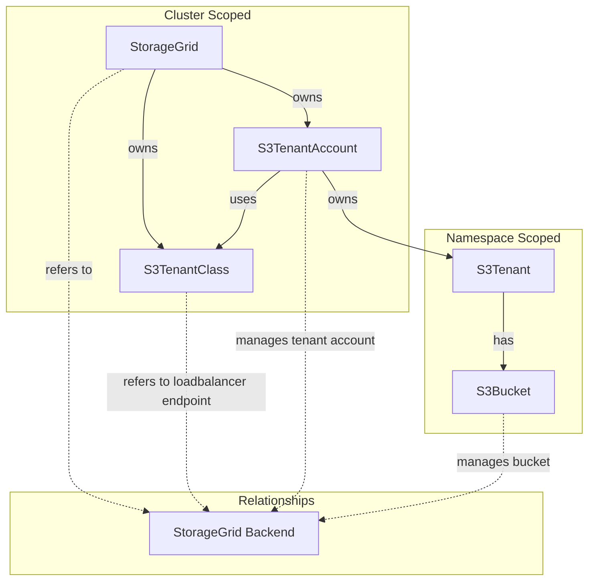

# StorageGrid Operator

A Kubernetes operator for managing NetApp StorageGrid S3 tenants and buckets as a native Kubernetes resource.

This operator is not created to manage your entire StorageGrid installation, but rather to provide a Kubernetes-native way to manage S3 resources on an existing StorageGrid backend.

## Overview

The StorageGrid Operator provides a Kubernetes-native way to manage S3 resources on NetApp StorageGrid. It allows you to define tenants, buckets, and configurations as Kubernetes custom resources, with the operator handling the lifecycle management and synchronization with the StorageGrid backend.

## Architecture



To better understand the architecture, please refer to the [Architecture Documentation](./docs/architecture/README.md).

## Custom Resources

This operator revolves around the following Custom Resource Definitions (CRDs):
* `StorageGrid`
* `S3TenantClass`
* `S3TenantAccount`
* `S3Tenant`
* `S3Bucket`

### StorageGrid
Cluster-scoped resource representing a StorageGrid installation. Manages connection credentials and global configuration.

Through this you can specify the endpoint as well as defaults for tenants referring to this StorageGrid. 

### S3TenantClass
Cluster-scoped resource defining S3 loadbalancer endpoint within your StorageGrid installation. Used by S3TenantAccounts to determine which endpoint to use.

This is similiar to an IngressClass in Kubernetes and always points to an existing loadbalancer endpoint in StorageGrid. Through the `spec.enforce` field you can enforce that tenants using this class will only be able to access the grid through this loadbalancer endpoint.

The operator automatically discovers all endpoints from the gateway's certificate SANs. You can control which endpoints are exposed to tenants using the `spec.preferredEndpoints` field:
- **Not set**: All discovered endpoints are exposed (default behavior)
- **Set with default + nil additionalEndpoints**: Default endpoint plus all discovered endpoints
- **Set with default + empty list `[]`**: Only the default endpoint is exposed
- **Set with default + explicit list**: Default endpoint plus only the specified endpoints

See more details on the official docs: https://docs.netapp.com/us-en/storagegrid-116/admin/configuring-load-balancer-endpoints.html 

### S3TenantAccount
Cluster-scoped resource representing the actual tenant account in StorageGrid backend. Manages the tenant lifecycle, credentials, and quotas.

You can imagine the `S3TenantAccount` somewhat similiar to a `PersistentVolume` in Kubernetes. It is a cluster-wide resource that provides the actual backend tenant account in StorageGrid. 

This resource in itself is not meant to be created directly, but rather through the `S3Tenant` resource. 

All interaction with the actual StorageGrid backend happens through this resource.

For more details on how the `S3TenantAccount` works, see the [tenant relationship](./docs/architecture/tenant-relationship.md).

### S3Tenant
Namespace-scoped resource providing a namespace-local view of a tenant. Creates and manages the underlying S3TenantAccount.

This then is the `PersistentVolumeClaim` equivalent in our analogy. It is a namespace-scoped resource that application teams can create to request a tenant account in StorageGrid. The operator will then create the corresponding `S3TenantAccount` in the cluster scope. 

### S3Bucket
Namespace-scoped resource for managing S3 buckets within a tenant. This is a basic interface to create and manage S3 buckets for your tenants and might be deprecated in the future in favor of more generic S3 operators. 

Currently it supports basic bucket CRUD operations as well as defining a policy that gets applied to the bucket.

## Features

- **Declarative Management**: Define S3 resources using Kubernetes manifests
- **Multi-Tenancy**: Support for multiple tenants with proper isolation
- **Quota Management**: Configure storage quotas per tenant
- **Credential Management**: Automatic generation and rotation of administrative and S3 credentials
- **Webhook Validation**: Built-in validation for resource configurations
- **Garbage Collection**: Proper cleanup cascade when resources are deleted
- **Metadata Enrichment**: As NetApp doesn't support tags on tenants, we enrich the tenant description with useful metadata such as the namespace, owner, and custom fields.
- **Event Observability**: Kubernetes events for state transitions, errors, and significant operations across all controllers

## Event Observability

The operator emits Kubernetes events for state transitions, errors, and significant operations across all controllers. Events provide a user-visible timeline of operations without requiring log access.

**Key characteristics:**
- 64 unique event types across 5 controllers
- Immediate emission for real-time visibility
- State-change emission to prevent spam
- Separate event streams per resource (no cross-resource propagation)

For detailed information on event architecture and implementation, see [Event Architecture](../docs/architecture/events.md).

### Critical Events

**S3 Endpoint Connectivity** - If bucket policy operations fail, check for:
- `S3EndpointConnectionFailed`: Cannot reach S3 loadbalancer endpoint
- `S3EndpointConnectionEstablished`: Connection successful

**Backend Connection** - For tenant operations:
- `BackendConnectionFailed`: Cannot reach StorageGrid management API
- `BackendConnectionRestored`: Management API connection restored

**Grid Health** - For overall grid status:
- `GridUnhealthy`: Too many unavailable nodes
- `GridHealthRecovered`: Grid has recovered

## Installation

### Prerequisites

- Kubernetes cluster (v1.20+)
- NetApp StorageGrid installation
- `kubectl` configured to access your cluster

### Required network access

The operator needs network access to the StorageGrid management endpoint as well as the S3 loadbalancer endpoints. Make sure that the cluster where the operator is running has access to these endpoints.

You can skip out on the S3 loadbalancer endpoints if you don't plan on using `spec.bucketPolicyJson`on your `S3Bucket` resource, but the management endpoint is required for all operations.

### Deploy the Operator

This operator is currently only provided as source. You can deploy it by cloning the repository and applying the manifests:

```bash
# Clone the repository
git clone https://git.mgmtbi.ch/cloud/storagegrid-operator.git
cd storagegrid-operator

# Deploy the operator
kubectl apply -f config/crd/bases/
kubectl apply -f config/rbac/
kubectl apply -f config/manager/
```

### Environment Variables

If you're not deploying the operator using the provided Kustomization, you can configure the operator using the following environment variables:

- `OPERATOR_NAMESPACE`: The namespace where the operator is running (defaults to `storagegrid-operator-system`)

## Usage

### 1. Create a StorageGrid Resource
Make sure to create your `Secret` containing the admin credentials for StorageGrid first.

```yaml
apiVersion: v1
kind: Secret
metadata:
  name: storagegrid-credentials
  namespace: storagegrid-operator-system
type: Opaque
data:
  username: <base64-encoded-username>
  password: <base64-encoded-password>
```

Then create the `StorageGrid` resource:

```yaml
apiVersion: s3.bedag.ch/v1alpha1
kind: StorageGrid
metadata:
  name: my-storagegrid
spec:
  endpoint: https://storagegrid.example.com
  credentialsSecret:
    name: storagegrid-credentials
    namespace: storagegrid-operator-system
```

### 2. Define an S3TenantClass

```yaml
apiVersion: s3.bedag.ch/v1alpha1
kind: S3TenantClass
metadata:
  name: default
spec:
  storageGridRef:
    name: my-storagegrid
  backingID: "gateway-endpoint-id" # check your storagegrid for the correct ID
  enforce: true
  
  # Optional: Control which endpoints are exposed to tenants
  # If not set, all discovered endpoints from the gateway certificate are exposed
  preferredEndpoints:
    defaultEndpoint: "s3.example.com"  # Primary endpoint (always exposed)
    # additionalEndpoints: []           # Empty list = only default endpoint
    # additionalEndpoints:              # Omit = all discovered endpoints
    #   - "s3-backup.example.com"       # Explicit list = only these + default
```

### 3. Create an S3Tenant

```yaml
apiVersion: s3.bedag.ch/v1alpha1
kind: S3Tenant
metadata:
  name: my-tenant
  namespace: default
spec:
  storageGridRef:
    name: my-storagegrid
  s3TenantClassName: default # or omit as it defaults to "default"
  description: "My application tenant"
  quota:
    limit: "100Gi"
  additionalTenantMetadata:
    project: "my-project"
    environment: "production"
    owner: "team-alpha"
```

#### Available Annotations
You can use the following annotations on the `S3Tenant` resource to modify its behavior:
```yaml
metadata:
  annotations:
    # Force recreation of S3 access keys on next reconciliation
    tenant.s3.bedag.ch/recreate-s3-access-keys: "true" 

    # Force deletion and recreation of the tenant on next reconciliation
    tenant.s3.bedag.ch/recreate-tenant: "true" 

    # As the change of the tenant class can lead to unexpected lose of access, this annotation must be set to allow the change of the tenant class.
    tenant.s3.bedag.ch/allow-tenant-class-name-change: "true" 

    # The tenant is protected from accidental deletion, setting this annotation to "true" will allow deletion of the tenant.
    tenant.s3.bedag.ch/allow-tenant-deletion: "true"
```

#### Secrets Created

When the `S3Tenant` is created, the operator will create multiple `Secrets` in the same namespace containing the S3 access credentials as well as the admin for the grid URL of the tenant. The secrets will be named `s3-tenant-<tenant-name>-s3-admin-keypair` and `s3-tenant-<tenant-name>-admin-credentials`.

These secrets can be used by your applications for administrative access to the tenant or for S3 access.

> [!NOTE]  
> Through setting the `spec.adminSecretRef` or `spec.s3AdminKeysSecretRef` fields on the `S3Tenant`, you can customize the names of these secrets. On existing secrets, the operator will remove the old ones and create the new ones.

#### How does the operator manage tenants?

When you create an `S3Tenant`, the operator will create a corresponding `S3TenantAccount` in the cluster scope. This resource manages the actual tenant account in StorageGrid and handles all interactions with the backend.

The `S3TenantAccount` will additionally store the root of the tenant in a `Secret` in the `storagegrid-operator-system` namespace. This secret is named `s3-tenant-<tenant-name>-root-credentials` and will be used by the operator to manage the tenant account.

On the `S3TenantAccount` you can additionally set the `admin.s3.bedag.ch/reset-admin-password` annotation to force a reset of the admin password used by the user on the next reconciliation.

#### Tenant Deletion Policies

The `S3TenantAccount` supports deletion policies (configured via `status.tenantDeletionPolicy`) that control what happens to the StorageGrid tenant when the account is deleted:

- **`Delete`**: Completely removes the tenant from StorageGrid backend (default for new accounts)
- **`Retain`**: Removes operator ownership metadata (the description) only, leaving the tenant in StorageGrid available for re-import or other use
- **`RetainThenDelete`**: Retains for a configured duration, then deletes

When using **`Retain` policy**, the operator:
1. Removes all operator-managed secrets (root, admin, S3 keys)
2. Clears ownership metadata (`managed_by`, `cr_uid`, `cr_name`, `kubernetes_namespace`) from the tenant description
3. Preserves user-provided description and custom metadata fields
4. Leaves the tenant intact in StorageGrid, making it available for re-import

This enables workflows like:
- Safely testing operator management without risk of data loss
- Moving tenant management between clusters
- Temporarily removing Kubernetes management while preserving the backend tenant

> [!TIP]
> Use `Retain` policy when you want to delete the Kubernetes resource but keep the StorageGrid tenant for later re-import or manual management.

### 3.1 Importing Existing Tenants

If you have existing tenants in StorageGrid that were created outside of the operator, you can import them to bring them under Kubernetes management.

**Important:** The import annotation (`admin.s3.bedag.ch/import-tenant-id`) is only supported on **S3TenantAccount** resources (cluster-scoped). Once imported, an S3Tenant (namespace-scoped) can claim the imported account using `spec.s3TenantAccountRef`.

#### Prerequisites for Import

1. **Tenant ID**: Find the existing tenant's ID from StorageGrid Admin UI or API
2. **Root Credentials**: The root user password must be known and provided in a pre-created Secret (StorageGrid API limitation - cannot be rotated programmatically)
3. **No owned in desciprtion**: Check the tenant description in StorageGrid to ensure it's not already managed by another operator instance (look for `cr_uid` field)

#### Import Process

**Step 1: Create a Secret with root credentials**

The secret must be created in the operator's namespace (typically `storagegrid-operator-system`):

```yaml
apiVersion: v1
kind: Secret
metadata:
  name: existing-tenant-root
  namespace: storagegrid-operator-system  # Operator namespace, not application namespace
type: Opaque
stringData:
  username: "root"                       # Always "root"
  password: "existing-root-password"  # Must be the actual root password from the backing StorageGrid *tenant*
```

**Step 2: Import the tenant as S3TenantAccount**

```yaml
apiVersion: s3.bedag.ch/v1alpha1
kind: S3TenantAccount  # Cluster-scoped resource - import happens here
metadata:
  name: imported-tenant-account
  annotations:
    admin.s3.bedag.ch/import-tenant-id: "12345678901234567890"  # Tenant ID from StorageGrid
spec:
  storageGridRef:
    name: my-storagegrid
  s3TenantClassName: default
  rootSecretRef:
    name: existing-tenant-root  # REQUIRED for imports - references the pre-created secret
  description: "Imported from existing StorageGrid tenant"
```

**Step 3: (Optional) Create S3Tenant to claim the imported account**

After the S3TenantAccount is successfully imported, you can create an S3Tenant to provide namespace-scoped access:

```yaml
apiVersion: s3.bedag.ch/v1alpha1
kind: S3Tenant
metadata:
  name: my-imported-tenant
  namespace: default  # Application namespace
spec:
  storageGridRef:
    name: my-storagegrid
  s3TenantClassName: default
  s3TenantAccountRef:
    name: imported-tenant-account  # References the imported S3TenantAccount
```

#### Import Behavior

**Single Ownership Model:**
- The operator takes **full ownership** of imported tenants
- Only one operator can manage a tenant at a time and will track ownership via description
- The import annotation is automatically removed after successful import

**Ownership Tracking:**
- Ownership is tracked via metadata in the tenant's description field in StorageGrid
- Metadata includes: `managed_by`, `cr_uid`, `cr_name`, `kubernetes_namespace`, `last_reconciled`
- This metadata is preserved even if the operator is uninstalled

**Import States:**
- **Unmanaged Tenant**: Import succeeds, operator takes ownership
- **Already Imported by This CR**: Import is idempotent, succeeds without changes
- **Managed by Different CR**: Import fails with ownership conflict error

#### Resolving Import Conflicts

If you attempt to import a tenant that's already managed by another CR, you'll receive an error like:

```
Cannot import tenant 12345678901234567890: already managed by another CR 'other-tenant' (UID: abc-123-def)

Conflict Resolution Options:
1. Delete the other CR 'other-tenant' in namespace 'other-namespace' if it's stale
2. Delete this CR and use the existing one instead
3. If the tenant was orphaned, manually edit the tenant description in StorageGrid to remove the 'cr_uid' field
```

**Resolution Steps:**

**Option 1 - Remove Stale CR:**
```bash
# If the other CR is from a deleted cluster or is no longer needed
kubectl delete s3tenant other-tenant -n other-namespace
# Wait for cleanup, then retry import
```

**Option 2 - Use Existing CR:**
```bash
# If the tenant is already managed elsewhere, use that CR instead
kubectl delete s3tenant imported-tenant -n default
```

**Option 3 - Manual StorageGrid Cleanup:**

If the tenant was truly orphaned (previous cluster deleted, CR lost, or you used `Retain` deletion policy):

1. Log into StorageGrid Admin UI
2. Navigate to the tenant details
3. Edit the tenant description
4. Remove the ownership metadata lines (or the entire description):
   ```
   managed_by:storagegrid-operator
   cr_uid:<some-uid>
   cr_name:<some-name>
   kubernetes_namespace:<some-namespace>
   ```
5. Save changes in StorageGrid
6. Retry the import in Kubernetes

> [!TIP]
> If you used `Retain` deletion policy on the S3TenantAccount, the operator already removed the ownership metadata for you - the tenant is immediately ready for re-import without manual cleanup!

#### Important Notes

> [!WARNING]  
> **Root Credentials Required**: Unlike newly created tenants, imports require `spec.rootSecretRef` to be set with the existing root password. This is a StorageGrid API limitation - root passwords cannot be rotated via API.

> [!NOTE]  
> **Import Annotation is Create-Only**: The `admin.s3.bedag.ch/import-tenant-id` annotation can only be set during resource creation. The webhook will reject attempts to add it during updates to prevent accidental tenant reassignment.

> [!TIP]  
> **Verify Before Import**: Check the tenant description in StorageGrid before importing to see if it's already managed by another operator instance.

#### Post-Import Operations

After successful import:
- The operator creates admin credentials and S3 access keys (stored in Secrets)
- The `rootSecretRef` continues to reference your pre-existing secret
- All normal reconciliation and lifecycle operations work as expected
- You can create `S3Bucket` resources that reference the imported tenant
- Quota, description, and other spec fields can be updated normally

### 4. Create S3 Buckets

```yaml
apiVersion: s3.bedag.ch/v1alpha1
kind: S3Bucket
metadata:
  name: my-bucket
  namespace: default
spec:
  s3TenantRef:
    name: my-tenant
  region: "us-east-1"
```

#### Bucket Lifecycle Phases

Buckets have the following lifecycle phases:

- **Pending**: Initial state, waiting for StorageGrid confirmation
- **Ready**: Normal operation, bucket available for object storage
- **Draining**: Automatically deleting all objects (see Draining Buckets below)
- **Failed**: Error condition requiring intervention
- **Deleting**: Finalizer cleanup, removing from StorageGrid

Monitor bucket phase:
```bash
kubectl get s3bucket my-bucket -o jsonpath='{.status.phase}'
```

#### Draining Buckets

Buckets cannot be deleted while they contain objects. Use the drain annotation to automatically delete all objects before bucket deletion:

**Trigger a drain:**
```bash
kubectl annotate s3bucket my-bucket bucket.s3.bedag.ch/force-drain-bucket=true
```

**Monitor drain progress:**
```bash
# Watch phase transition to Draining
kubectl get s3bucket my-bucket -w

# Check detailed drain status
kubectl get s3bucket my-bucket -o yaml | yq .status.drainStatus

# View drain events
kubectl describe s3bucket my-bucket
```

**Cancel an in-progress drain:**
```bash
kubectl annotate s3bucket my-bucket bucket.s3.bedag.ch/force-drain-bucket-
```

**Configure drain behavior:**

Drain polling intervals and thresholds can be customized at the bucket or grid level:

```yaml
# Grid-level configuration (applies to all buckets)
# Likely done by the grid administrator
apiVersion: s3.bedag.ch/v1alpha1
kind: StorageGrid
metadata:
  name: my-storagegrid
spec:
  operations:
    drain:
      initialPollInterval: "3m"        # Fast polling initially
      longRunningPollInterval: "30m"   # Slower after 1 hour
      stuckThreshold: "3h"             # Warning if no progress

---
# Bucket-level override (highest priority)
apiVersion: s3.bedag.ch/v1alpha1
kind: S3Bucket
metadata:
  name: my-large-bucket
spec:
  drainPollInterval: "5m"       # Custom polling interval
  drainStuckThreshold: "2h"     # Custom stuck detection
```

**Drain States:**
- Operator polls StorageGrid for progress every 3-30 minutes
- Emits events for started, progress, stuck, complete, and cancelled states
- Automatically removes annotation when drain completes
- Returns bucket to Ready phase after successful drain

For drain architecture details, see [Drain Operations Architecture](../docs/architecture/drain-operations.md).

#### Deleting Tenants with Buckets

To delete a tenant that has buckets:

1. **Drain all tenant buckets:**
   ```bash
   kubectl annotate s3buckets -l tenant=my-tenant bucket.s3.bedag.ch/force-drain-bucket=true
   ```

2. **Monitor drain progress:**
   ```bash
   kubectl get s3buckets -l tenant=my-tenant -w
   ```

3. **Delete empty buckets or wait for drain completion:**
   ```bash
   # Buckets auto-delete after draining if you delete them
   kubectl delete s3buckets -l tenant=my-tenant
   ```

4. **Delete the tenant:**
   ```bash
   kubectl delete s3tenant my-tenant
   ```

#### Secrets Created

When the `S3Bucket` is created, the operator will create a corresponding `Secret` in the same namespace containing the S3 access credentials for the bucket. The secret will be named `s3-bucket-<bucket-name>-credentials`.

This user will have full access to the bucket and may be used instead of the admin credentials of the `S3Tenant` to ensure proper least-privilege access.

> [!NOTE]  
> Same as with the `S3Tenant`, you can customize the name of this secret through the `spec.s3AdminKeysSecretRef` field on the `S3Bucket`.

## Configuration

### Endpoint Filtering

The operator discovers all endpoints from the StorageGrid gateway's certificate SANs. By default, all discovered endpoints (DNS names and VIPs) are exposed to tenants. You can control this using `preferredEndpoints` in the S3TenantClass:

**Expose all discovered endpoints (default)**:
```yaml
spec:
  # preferredEndpoints not set - all endpoints exposed, first as default
```

**Expose specific endpoints only**:
```yaml
spec:
  preferredEndpoints:
    defaultEndpoint: "s3.example.com"
    additionalEndpoints:
      - "s3-backup.example.com"
      - "192.168.1.100"
```

**Expose only the default endpoint**:
```yaml
spec:
  preferredEndpoints:
    defaultEndpoint: "s3.example.com"
    additionalEndpoints: []  # Empty list = default only
```

**Expose default + all discovered**:
```yaml
spec:
  preferredEndpoints:
    defaultEndpoint: "s3.example.com"
    # additionalEndpoints omitted = include all discovered
```

**Behavior notes**:
- Addresses not found in certificate SANs are kept with a warning event (admin knows best)
- When `additionalEndpoints` is nil (unset), all discovered addresses are included
- When `additionalEndpoints` is an empty list `[]`, only the default is exposed
- The default address is always listed first in status
- All addresses in the configuration point to the same gateway/loadbalancer

### Tenant Metadata

As NetApp doesn't support tags on tenants, we enrich the tenant description with useful metadata.  
The operator automatically enriches tenant descriptions with metadata:

- `kubernetes_namespace`: The namespace of the S3Tenant
- `user_description`: Custom description field
- Custom fields from `additionalTenantMetadata`

### Webhooks

The operator includes validation webhooks for:
- S3TenantAccount validation
- S3Bucket validation

To disable webhooks, set the environment variable:
```bash
export ENABLE_WEBHOOKS=false
```

## Development

### Prerequisites

- Go 1.21+
- Docker
- Kubebuilder v3.0+

### Building

```bash
# Build the operator
make build

# Build and push Docker image
make docker-build docker-push IMG=your-registry/storagegrid-operator:tag

# Deploy to cluster
make deploy IMG=your-registry/storagegrid-operator:tag
```

### Testing

```bash
# Run unit tests
make test

# Run with coverage
make test-coverage
```

### Code Generation

```bash
# Generate CRDs and code
make generate manifests
```

## Monitoring

The operator exposes metrics on port 8443 (HTTPS) or 8080 (HTTP). Health checks are available on port 8081.

### Available Endpoints

- `/metrics` - Prometheus metrics
- `/healthz` - Health check
- `/readyz` - Readiness check

## Troubleshooting

### Common Issues

1. **StorageGrid Connection Issues**: Verify credentials and network connectivity

### Debug Logging

Enable debug logging by setting the log level:
```bash
--zap-log-level=1  # or higher for more verbose logging
```

## Contributing

1. Fork the repository
2. Create a feature branch
3. Make your changes
4. Add tests for new functionality
5. Run the test suite
6. Submit a pull request

### Code Style

- Follow standard Go conventions
- Use `gofmt` for formatting
- Add appropriate comments for exported functions
- Include unit tests for new features

## License

Licensed under the Apache License, Version 2.0. See LICENSE file for details.

## Support

For issues and questions:

- Create an issue in the repository
- Check existing documentation
- Review the troubleshooting section

## Roadmap

- [x] Add Events
- [x] Implement bucket drain annotation for automatic object deletion
- [x] Allow the import of existing grid accounts as S3TenantAccount resources
- [ ] Implement labels for all resources for easier filtering
- [ ] Integrate proper e2e tests - currently unable to test against a real StorageGrid instance due to lack of grid docker license. 
- [ ] Write proper metrics of CRs created and backend calls
- [ ] Allow the use of labels for `S3Tenant.spec.AllowedNamespaces` to allow more flexible tenant access control

