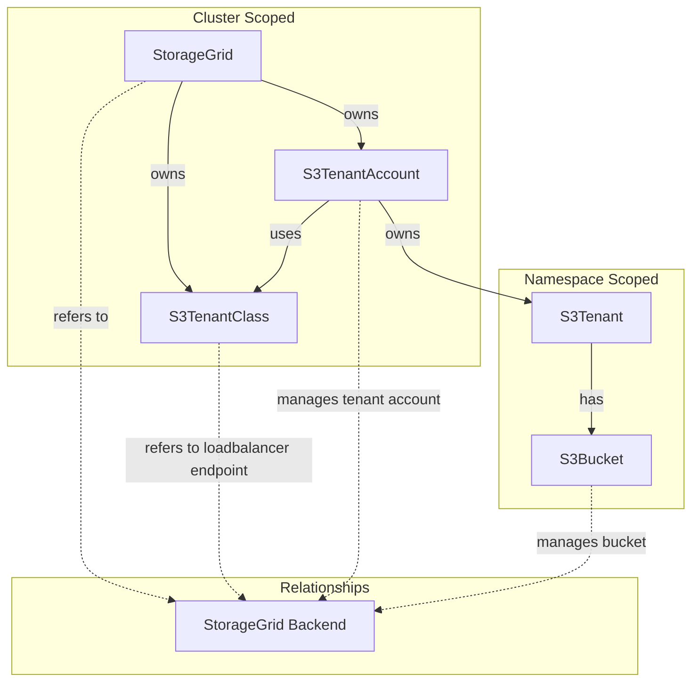

# StorageGrid Operator

A Kubernetes operator for managing NetApp StorageGrid S3 tenants and buckets as a native Kubernetes resource.

This operator is not created to manage your entire StorageGrid installation, but rather to provide a Kubernetes-native way to manage S3 resources on an existing StorageGrid backend.

## Overview

The StorageGrid Operator provides a Kubernetes-native way to manage S3 resources on NetApp StorageGrid. It allows you to define tenants, buckets, and configurations as Kubernetes custom resources, with the operator handling the lifecycle management and synchronization with the StorageGrid backend.

## Architecture



To better understand the architecture, please refer to the [Architecture Documentation](./docs/architecture/README.md).

## Custom Resources

This operator revolves around the following Custom Resource Definitions (CRDs):
* `StorageGrid`
* `S3TenantClass`
* `S3TenantAccount`
* `S3Tenant`
* `S3Bucket`

### StorageGrid
Cluster-scoped resource representing a StorageGrid installation. Manages connection credentials and global configuration.

Through this you can specify the endpoint as well as defaults for tenants referring to this StorageGrid. 

### S3TenantClass
Cluster-scoped resource defining S3 loadbalancer endpoint within your StorageGrid installation. Used by S3TenantAccounts to determine which endpoint to use.

This is similiar to an IngressClass in Kubernetes and always points to an existing loadbalancer endpoint in StorageGrid. Through the `spec.enforce` field you can enforce that tenants using this class will only be able to access the grid through this loadbalancer endpoint.

See more details on the official docs: https://docs.netapp.com/us-en/storagegrid-116/admin/configuring-load-balancer-endpoints.html 

### S3TenantAccount
Cluster-scoped resource representing the actual tenant account in StorageGrid backend. Manages the tenant lifecycle, credentials, and quotas.

You can imagine the `S3TenantAccount` somewhat similiar to a `PersistentVolume` in Kubernetes. It is a cluster-wide resource that provides the actual backend tenant account in StorageGrid. 

This resource in itself is not meant to be created directly, but rather through the `S3Tenant` resource. 

All interaction with the actual StorageGrid backend happens through this resource.

For more details on how the `S3TenantAccount` works, see the [tenant relationship](./docs/architecture/tenant-relationship.md).

### S3Tenant
Namespace-scoped resource providing a namespace-local view of a tenant. Creates and manages the underlying S3TenantAccount.

This then is the `PersistentVolumeClaim` equivalent in our analogy. It is a namespace-scoped resource that application teams can create to request a tenant account in StorageGrid. The operator will then create the corresponding `S3TenantAccount` in the cluster scope. 

### S3Bucket
Namespace-scoped resource for managing S3 buckets within a tenant. This is a basic interface to create and manage S3 buckets for your tenants and might be deprecated in the future in favor of more generic S3 operators. 

Currently it supports basic bucket CRUD operations as well as defining a policy that gets applied to the bucket.

## Features

- **Declarative Management**: Define S3 resources using Kubernetes manifests
- **Multi-Tenancy**: Support for multiple tenants with proper isolation
- **Quota Management**: Configure storage quotas per tenant
- **Credential Management**: Automatic generation and rotation of administrative and S3 credentials
- **Webhook Validation**: Built-in validation for resource configurations
- **Garbage Collection**: Proper cleanup cascade when resources are deleted
- **Metadata Enrichment**: As NetApp doesn't support tags on tenants, we enrich the tenant description with useful metadata such as the namespace, owner, and custom fields.

## Installation

### Prerequisites

- Kubernetes cluster (v1.20+)
- NetApp StorageGrid installation
- `kubectl` configured to access your cluster

### Required network access

The operator needs network access to the StorageGrid management endpoint as well as the S3 loadbalancer endpoints. Make sure that the cluster where the operator is running has access to these endpoints.

You can skip out on the S3 loadbalancer endpoints if you don't plan on using `spec.bucketPolicyJson`on your `S3Bucket` resource, but the management endpoint is required for all operations.

### Deploy the Operator

This operator is currently only provided as source. You can deploy it by cloning the repository and applying the manifests:

```bash
# Clone the repository
git clone https://git.mgmtbi.ch/cloud/storagegrid-operator.git
cd storagegrid-operator

# Deploy the operator
kubectl apply -f config/crd/bases/
kubectl apply -f config/rbac/
kubectl apply -f config/manager/
```

### Environment Variables

If you're not deploying the operator using the provided Kustomization, you can configure the operator using the following environment variables:

- `OPERATOR_NAMESPACE`: The namespace where the operator is running (defaults to `storagegrid-operator-system`)

## Usage

### 1. Create a StorageGrid Resource
Make sure to create your `Secret` containing the admin credentials for StorageGrid first.

```yaml
apiVersion: v1
kind: Secret
metadata:
  name: storagegrid-credentials
  namespace: storagegrid-operator-system
type: Opaque
data:
  username: <base64-encoded-username>
  password: <base64-encoded-password>
```

Then create the `StorageGrid` resource:

```yaml
apiVersion: s3.bedag.ch/v1alpha1
kind: StorageGrid
metadata:
  name: my-storagegrid
spec:
  endpoint: https://storagegrid.example.com
  credentialsSecret:
    name: storagegrid-credentials
    namespace: storagegrid-operator-system
```

### 2. Define an S3TenantClass

```yaml
apiVersion: s3.bedag.ch/v1alpha1
kind: S3TenantClass
metadata:
  name: default
spec:
  storageGridRef:
    name: my-storagegrid
  backingID: "gateway-endpoint-id" # check your storagegrid for the correct ID
  enforce: true
```

### 3. Create an S3Tenant

```yaml
apiVersion: s3.bedag.ch/v1alpha1
kind: S3Tenant
metadata:
  name: my-tenant
  namespace: default
spec:
  storageGridRef:
    name: my-storagegrid
  s3TenantClassName: default # or omit as it defaults to "default"
  description: "My application tenant"
  quota:
    limit: "100Gi"
  additionalTenantMetadata:
    project: "my-project"
    environment: "production"
    owner: "team-alpha"
```

#### Available Annotations
You can use the following annotations on the `S3Tenant` resource to modify its behavior:
```yaml
metadata:
  annotations:
    # Force recreation of S3 access keys on next reconciliation
    tenant.s3.bedag.ch/recreate-s3-access-keys: "true" 

    # Force deletion and recreation of the tenant on next reconciliation
    tenant.s3.bedag.ch/recreate-tenant: "true" 

    # As the change of the tenant class can lead to unexpected lose of access, this annotation must be set to allow the change of the tenant class.
    tenant.s3.bedag.ch/allow-tenant-class-name-change: "true" 

    # The tenant is protected from accidental deletion, setting this annotation to "true" will allow deletion of the tenant.
    tenant.s3.bedag.ch/allow-tenant-deletion: "true"
```

#### Secrets Created

When the `S3Tenant` is created, the operator will create multiple `Secrets` in the same namespace containing the S3 access credentials as well as the admin for the grid URL of the tenant. The secrets will be named `s3-tenant-<tenant-name>-s3-admin-keypair` and `s3-tenant-<tenant-name>-admin-credentials`.

These secrets can be used by your applications for administrative access to the tenant or for S3 access.

> [!NOTE]  
> Through setting the `spec.adminSecretRef` or `spec.s3AdminKeysSecretRef` fields on the `S3Tenant`, you can customize the names of these secrets. On existing secrets, the operator will remove the old ones and create the new ones.

#### How does the operator manage tenants?

When you create an `S3Tenant`, the operator will create a corresponding `S3TenantAccount` in the cluster scope. This resource manages the actual tenant account in StorageGrid and handles all interactions with the backend.

The `S3TenantAccount` will additionally store the root of the tenant in a `Secret` in the `storagegrid-operator-system` namespace. This secret is named `s3-tenant-<tenant-name>-root-credentials` and will be used by the operator to manage the tenant account.

On the `S3TenantAccount` you can additionally set the `admin.s3.bedag.ch/reset-admin-password` annotation to force a reset of the admin password used by the user on the next reconciliation.


### 4. Create S3 Buckets

```yaml
apiVersion: s3.bedag.ch/v1alpha1
kind: S3Bucket
metadata:
  name: my-bucket
  namespace: default
spec:
  s3TenantRef:
    name: my-tenant
  region: "us-east-1"
```

#### Secrets Created

When the `S3Bucket` is created, the operator will create a corresponding `Secret` in the same namespace containing the S3 access credentials for the bucket. The secret will be named `s3-bucket-<bucket-name>-credentials`.

This user will have full access to the bucket and may be used instead of the admin credentials of the `S3Tenant` to ensure proper least-privilege access.

> [!NOTE]  
> Same as with the `S3Tenant`, you can customize the name of this secret through the `spec.s3AdminKeysSecretRef` field on the `S3Bucket`.

## Configuration

### Tenant Metadata

As NetApp doesn't support tags on tenants, we enrich the tenant description with useful metadata.  
The operator automatically enriches tenant descriptions with metadata:

- `kubernetes_namespace`: The namespace of the S3Tenant
- `user_description`: Custom description field
- Custom fields from `additionalTenantMetadata`

### Webhooks

The operator includes validation webhooks for:
- S3TenantAccount validation
- S3Bucket validation

To disable webhooks, set the environment variable:
```bash
export ENABLE_WEBHOOKS=false
```

## Development

### Prerequisites

- Go 1.21+
- Docker
- Kubebuilder v3.0+

### Building

```bash
# Build the operator
make build

# Build and push Docker image
make docker-build docker-push IMG=your-registry/storagegrid-operator:tag

# Deploy to cluster
make deploy IMG=your-registry/storagegrid-operator:tag
```

### Testing

```bash
# Run unit tests
make test

# Run with coverage
make test-coverage
```

### Code Generation

```bash
# Generate CRDs and code
make generate manifests
```

## Monitoring

The operator exposes metrics on port 8443 (HTTPS) or 8080 (HTTP). Health checks are available on port 8081.

### Available Endpoints

- `/metrics` - Prometheus metrics
- `/healthz` - Health check
- `/readyz` - Readiness check

## Troubleshooting

### Common Issues

1. **StorageGrid Connection Issues**: Verify credentials and network connectivity

### Debug Logging

Enable debug logging by setting the log level:
```bash
--zap-log-level=1  # or higher for more verbose logging
```

## Contributing

1. Fork the repository
2. Create a feature branch
3. Make your changes
4. Add tests for new functionality
5. Run the test suite
6. Submit a pull request

### Code Style

- Follow standard Go conventions
- Use `gofmt` for formatting
- Add appropriate comments for exported functions
- Include unit tests for new features

## License

Licensed under the Apache License, Version 2.0. See LICENSE file for details.

## Support

For issues and questions:

- Create an issue in the repository
- Check existing documentation
- Review the troubleshooting section

## Roadmap

- [ ] Add Events
- [ ] Implement Annotations to drain buckets and tenants on request
- [ ] Integrate proper e2e tests - currently unable to test against a real StorageGrid instance due to lack of grid docker license. 
- [ ] Write proper metrics of CRs created and backend calls
- [ ] Allow the import of existing grid accounts as S3TenantAccount resources
- [ ] Allow the use of labels for `S3Tenant.spec.AllowedNamespaces` to allow more flexible tenant access control

