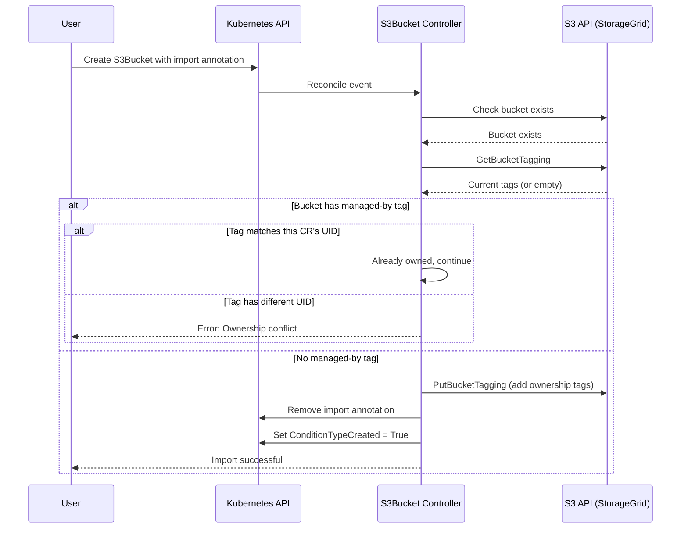

# Bucket Import Architecture

This document explains how the S3Bucket import feature works, including the ownership protection mechanism using S3 bucket tagging.

## Overview

The bucket import feature allows operators to bring existing S3 buckets under Kubernetes management. Unlike tenant imports which use description metadata, bucket imports leverage the **S3 Tagging API** for ownership tracking. This provides a robust, standards-based mechanism that works across any S3-compatible storage system.

## Why S3 Tags?

We chose S3 bucket tags over other approaches for several reasons:

1. **Standards-Based**: S3 tagging is part of the S3 API specification, ensuring compatibility
2. **Atomic Operations**: Tag operations are atomic and don't interfere with bucket data
3. **No Data Path Impact**: Tags are metadata-only, they don't affect object operations
4. **Query Capability**: Tags can be queried via the S3 API without special permissions
5. **Familiar Pattern**: Mirrors Kubernetes label patterns, familiar to operators

## Ownership Tags

The operator uses four tags to track bucket ownership:

| Tag Key | Example Value | Purpose |
|---------|---------------|---------|
| `s3.bedag.ch/managed-by` | `storagegrid-operator` | Indicates the bucket is managed |
| `s3.bedag.ch/bucket-namespace` | `production` | Kubernetes namespace of the S3Bucket CR |
| `s3.bedag.ch/bucket-name` | `my-bucket` | Name of the S3Bucket CR |
| `s3.bedag.ch/bucket-uid` | `a1b2c3d4-...` | UID of the S3Bucket CR |

These tags together form a complete ownership record, enabling:
- Detection of managed vs unmanaged buckets
- Identification of the owning Kubernetes resource
- Cross-cluster conflict detection

## Import Flow



## Ownership Check Logic

The controller performs a two-phase ownership check:

### Phase 1: Is Bucket Managed?

```go
// Check if managed-by tag exists and has expected value
if tags["s3.bedag.ch/managed-by"] == "storagegrid-operator" {
    return true, nil  // Bucket is managed by some operator instance
}
return false, nil  // Bucket is unmanaged, safe to import
```

### Phase 2: Is Bucket Owned By This CR?

```go
// All four tags must match for ownership
expectedTags := map[string]string{
    "s3.bedag.ch/managed-by":        "storagegrid-operator",
    "s3.bedag.ch/bucket-namespace":  bucket.Namespace,
    "s3.bedag.ch/bucket-name":       bucket.Name,
    "s3.bedag.ch/bucket-uid":        string(bucket.UID),
}

for key, expected := range expectedTags {
    if tags[key] != expected {
        return false, nil  // Not owned by this CR
    }
}
return true, nil  // Owned by this CR
```

## Conflict Resolution

When a bucket is already managed by another entity, the import fails with a descriptive error:

```
Bucket is managed by another entity (
  s3.bedag.ch/managed-by=storagegrid-operator,
  s3.bedag.ch/bucket-namespace=other-ns,
  s3.bedag.ch/bucket-name=other-bucket,
  s3.bedag.ch/bucket-uid=xyz-123
), cannot be owned
```

### Resolution Options

1. **Delete the conflicting S3Bucket CR** if it's stale or orphaned
2. **Use force-ownership annotation** (dangerous, see below)
3. **Manually remove tags** from the bucket in StorageGrid

## Force Ownership

For disaster recovery scenarios where the owning CR no longer exists, you can force ownership:

```yaml
metadata:
  annotations:
    bucket.s3.bedag.ch/import-bucket-name: "existing-bucket"
    bucket.s3.bedag.ch/force-bucket-ownership: "true"  # Override existing tags
```

> ⚠️ **Warning**: Force ownership skips all safety checks. Only use when you are certain the bucket should be re-assigned to this CR.

When force ownership is used:
1. Existing ownership tags are overwritten
2. No conflict detection is performed
3. The annotation is removed after successful import

## Tag Lifecycle

### During Normal Operation

After bucket creation or import, the controller periodically verifies ownership tags remain intact. If tags are removed or modified externally, the controller will:

1. Detect the discrepancy during reconciliation
2. Re-apply the correct ownership tags
3. Emit a warning event about external modification

### During Bucket Deletion

When an S3Bucket CR is deleted:

1. The bucket is optionally drained (if annotation present)
2. The bucket is deleted from StorageGrid
3. Tags are implicitly removed with the bucket

### Future: Retain Policy for Buckets

A future enhancement could implement a "Retain" deletion policy for buckets (similar to S3TenantAccount), which would:

1. Remove ownership tags from the bucket
2. Leave the bucket and its data intact
3. Allow re-import by a different CR

For now this will have to be done manually by removing the finalizer before deletion. And force-ownership can be used to re-import.

## Implementation Details

### S3 Client Requirements

The S3 client used for tagging operations needs:
- `s3:GetBucketTagging` permission
- `s3:PutBucketTagging` permission

These are typically included in bucket admin permissions automatically.

### Error Handling

The controller handles several S3 tagging edge cases:

| Scenario | Handling |
|----------|----------|
| Bucket doesn't exist | Fail import with clear error |
| No tagging permission | Fail with permission error |
| Network timeout | Retry on next reconciliation |
| Malformed tags | Log warning, attempt to fix |

### Tag Limits

S3 allows up to 10 tags per bucket. The operator uses 4 for ownership, leaving 6 available for user-defined tags. If a bucket already has 10 tags, the import will fail.

## Security Considerations

### Tag Tampering

An attacker with S3 access could:
- Remove ownership tags (making bucket appear unmanaged)
- Modify tags to point to a different CR

Mitigations:
1. Regular reconciliation re-applies correct tags
2. The UID check prevents simple name spoofing
3. RBAC controls limit who can access bucket admin credentials

### Cross-Cluster Imports

When multiple clusters manage the same StorageGrid:
- The UID in tags will differ between clusters
- Import will fail with ownership conflict
- Force-ownership allows explicit override when needed

## Related Documentation

- [Controller Patterns](./controller-patterns.md) - Understanding the reconciliation flow
- [Separation of Concerns](./separation-of-concerns.md) - Where import logic lives
- [Tenant Relationship](./tenant-relationship.md) - How buckets relate to tenants
