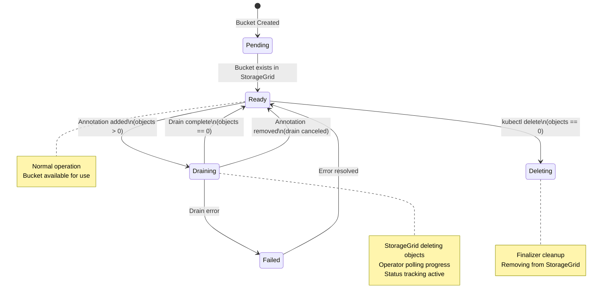
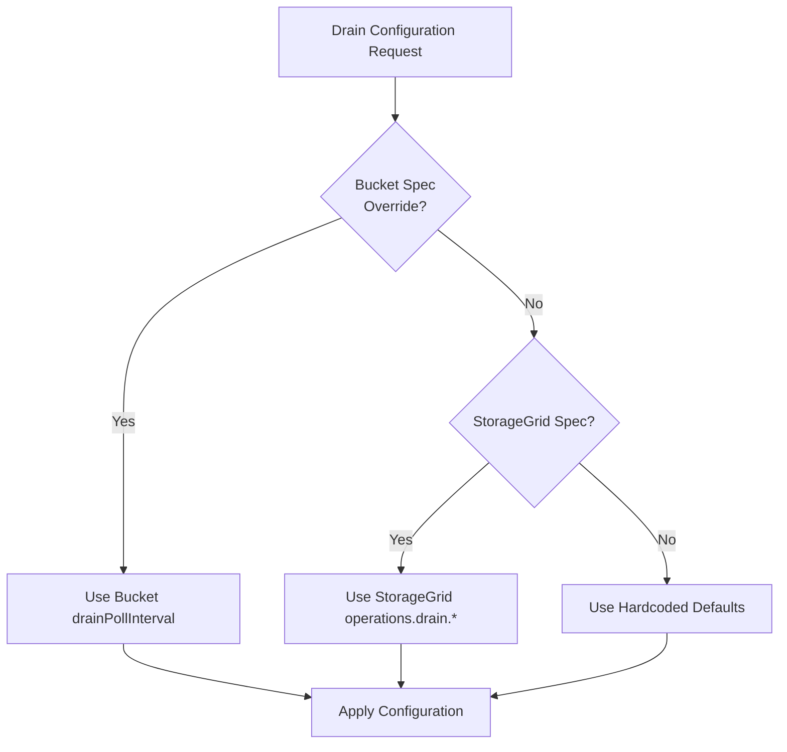

# Drain Operations Architecture

## Overview

This document describes the bucket drain functionality and explains the architectural decision to not implement tenant-level drain orchestration.

## Bucket Drain

### Purpose

Bucket drain allows users to automatically delete all objects from an S3 bucket before deleting the bucket resource itself. This is essential because:

1. StorageGrid buckets cannot be deleted while they contain objects
2. Manual object deletion is impractical for buckets with many objects
3. Users need a declarative way to express "delete this bucket and everything in it"

### State Machine

The bucket drain follows a clear state machine with the following phases:



**Phase Descriptions:**

- **Pending**: Initial state after bucket creation, waiting for backend confirmation
- **Ready**: Normal operation, bucket available for object storage
- **Draining**: StorageGrid actively deleting objects, operator polling progress
- **Failed**: Error condition, requires intervention
- **Deleting**: Finalizer processing, removing bucket from StorageGrid

#### Implementation Details

**1. Drain Detection (`reconcileDrain`)**

The controller detects when to start, poll, cancel, or complete a drain:

```go
// State machine transitions
case wantsDrain && !isDraining && objectCount > 0:
    return r.initiateDrain(ctx, rctx)
case isDraining && wantsDrain && objectCount > 0:
    return r.pollDrainProgress(ctx, rctx, backendStatus)
case isDraining && !wantsDrain:
    return r.cancelDrain(ctx, rctx)
case isDraining && objectCount == 0:
    return r.completeDrain(ctx, rctx)
```

**2. Drain Initiation (`initiateDrain`)**

- Calls StorageGrid API to start drain operation
- Sets bucket phase to `Draining`
- Records initial object count and timestamp
- Computes next poll interval based on configuration

**3. Progress Polling (`pollDrainProgress`)**

- Recomputes poll interval every reconciliation (picks up config changes)
- Two-tier polling strategy:
  - **Initial**: 3 minutes (first hour when progress is faster)
  - **Long-running**: 30 minutes (after 1 hour for large buckets)
- Tracks object count changes to detect progress
- Emits warning if stuck (no progress for 3 hours by default)

**4. Completion (`completeDrain`)**

- Verifies object count is zero
- Cleans up drain status
- Removes annotation
- Returns phase to `Ready`

**5. Cancellation (`cancelDrain`)**

- User removes annotation while draining
- Calls StorageGrid API to stop drain
- Cleans up drain status
- Returns phase to `Ready`

**6. Orphaned Drain Detection**

If the operator detects the backend is draining but we have no drain status (e.g., drain initiated outside K8s), the operator cancels it:

```go
if backendStatus.IsDeletingObjects && 
   (DrainStatus == nil || DrainStatus.StartedAt == nil) {
    return r.cancelOrphanedDrain(ctx, rctx, backendStatus)
}
```

### Configuration

Drain behavior is configurable at three levels with clear precedence:

**Precedence:** Bucket Spec > StorageGrid Spec > Hardcoded Defaults



**Configuration Levels:**

1. **Bucket-Level Override** (Highest Priority)
   - `spec.drainPollInterval`: Single interval for all polling
   - `spec.drainStuckThreshold`: Custom stuck detection threshold

2. **Grid-Level Configuration** (Medium Priority)
   - `spec.operations.drain.initialPollInterval`: First hour polling interval
   - `spec.operations.drain.longRunningPollInterval`: After first hour interval
   - `spec.operations.drain.stuckThreshold`: Warning if no progress

3. **Hardcoded Defaults** (Lowest Priority)
   - Initial: 3 minutes
   - Long-running: 15 minutes
   - Stuck threshold: 3 hours DefaultDrainLongRunningPollInterval = 15 * time.Minute
    DefaultDrainStuckThreshold          = 3 * time.Hour

### Status Tracking

The drain status provides full observability:

```go
type BucketDrainStatus struct {
    StartedAt           *metav1.Time       // When drain began
    IsDeletingObjects   bool               // Backend drain active
    InitialObjectCount  int64              // Objects at start
    InitialObjectBytes  int64              // Bytes at start
```

### Status Tracking

The drain status provides full observability into the drain operation:

```go
type BucketDrainStatus struct {
    StartedAt           *metav1.Time       // When drain began
    IsDeletingObjects   bool               // Backend drain active
    InitialObjectCount  int64              // Objects at start
    InitialObjectBytes  int64              // Bytes at start
    LastCheckedAt       *metav1.Time       // Last poll time
    LastProgressAt      *metav1.Time       // Last time count decreased
    PreviousObjectCount int64              // For progress detection
    Message             string             // Human-readable status
    NextPollInterval    metav1.Duration    // When to poll next
}
```

### Events

The controller emits events for all drain state transitions providing real-time observability:

| Event Reason | Type | Description |
|-------------|------|-------------|
| `BucketDrainingStarted` | Normal | Drain initiated, shows initial object count |
| `BucketDrainingProgress` | Normal | Progress update, objects deleted |
| `BucketDrainingStuck` | Warning | No progress for threshold period |
| `BucketDrainingComplete` | Normal | Drain finished successfully |
| `BucketDrainingCanceled` | Normal | User canceled drain |
| `BucketOrphanedDrain` | Warning | Detected and canceled drain not initiated by operator |
| `BucketAlreadyEmpty` | Normal | Drain annotation added but no objects to delete | Implements two-tier polling (fast initially, slower for large buckets)

```go
// Reconcile just reads the precomputed interval
if bucket.Status.Phase == Draining {
    return ctrl.Result{
        RequeueAfter: bucket.Status.DrainStatus.NextPollInterval.Duration
    }, err
}

// Every drain reconciliation recomputes it
func pollDrainProgress() {
    elapsed := time.Since(drainStatus.StartedAt)
    nextPollInterval := computeNextPollInterval(ctx, rctx, elapsed)
    drainStatus.NextPollInterval = metav1.Duration{Duration: nextPollInterval}
}
```

## Tenant Drain: Not Implemented

### The Proposal

The initial idea was to implement tenant-level drain that would:

1. Fan out drain annotations to all buckets in the tenant
2. Wait for all buckets to drain
3. Delete buckets when empty
4. Handle both K8s bucket resources and external buckets
5. Delete tenant when all buckets are gone

### Why We Decided Not To Build This

#### 1. Massive Complexity for Marginal Benefit

**Complexity explosion:**
- Hybrid K8s/backend reconciliation (buckets may be created/deleted externally)
- State tracking for N buckets in tenant status
- Edge cases: stuck buckets, new buckets created during drain, external buckets

**User can already do this simply:**

```bash
# Drain all buckets for a tenant
kubectl get s3buckets -l tenant=my-tenant -o name | \
  xargs -I {} kubectl annotate {} bucket.s3.bedag.ch/force-drain-bucket=true

# Wait for completion
kubectl wait --for=delete s3buckets -l tenant=my-tenant --timeout=24h

# Delete tenant
kubectl delete s3tenant my-tenant
```

This is **more transparent** and gives users **full control**.

#### 2. Violates Single Responsibility Principle

- **Tenant controller should manage tenants**
- **Bucket controller should manage buckets**
- Tenant orchestrating bucket operations creates tight coupling
- Blurs architectural boundaries

#### 3. External Buckets Problem Is Unsolvable Cleanly

- If we ignore external buckets: feature is incomplete/broken
- If we handle external buckets: we bypass our own abstractions
- Mixed environments create confusion
- Better: users clean up external buckets manually (they created them outside K8s anyway)

#### 4. Industry Precedent: Operators Don't Do This

**Survey of comparable operators:**

- **AWS Controllers (ACK)**: No cascading drain operations
- **Crossplane**: Each resource independent, no orchestration
- **CloudNativePG**: Only drains single cluster resource (not "all databases")
- **Redis Operator**: No cascading operations

**Pattern:** Operators focus on infrastructure lifecycle, not data lifecycle orchestration.

#### 5. Production Reality

Deleting production tenants is:
- **Rare**: Not a frequent operation
- **High-stakes**: Requires approval workflows
- **Needs audit**: Manual checkpoints and verification
- **Requires rollback**: May need to abort mid-process

A magic annotation doesn't fit these requirements. Production needs:
- Scripts with approval gates
- Manual verification checkpoints
- Backup verification before deletion
- Clear audit trail

### The YAGNI Principle

**"You Aren't Gonna Need It"**

Every feature has a cost:
- Code complexity and maintenance
- Test coverage requirements
- Documentation burden
- Bug surface area

Only add features when:
1. ✅ Users are actively requesting it
2. ✅ Manual approach is truly painful
3. ✅ Operator is mature enough for complexity

**Tenant drain fails all three criteria.**

### What We Provide Instead

The operator provides clear error messages and guidance when tenant deletion fails due to existing buckets, directing users to drain buckets first using the bucket drain annotation.

### Decision

**We will not implement tenant drain orchestration.** 

Focus areas:
- Rock-solid bucket drain implementation
- Comprehensive documentation in project README
- Clear error messages and webhook guidance
- Operator stability and maturity

If users require tenant drain automation after production usage, we'll have better context for requirements and can build it appropriately.

## Architecture Patterns

### Hybrid Polling Strategy

The operator stores `NextPollInterval` in status but recomputes it on every reconciliation. This hybrid approach:

- ✅ Keeps Reconcile() simple (one-line requeue)
- ✅ Picks up configuration changes during active drains
- ✅ Implements two-tier polling (fast initially, slower for large buckets)

```go
// Reconcile just reads the precomputed interval
if bucket.Status.Phase == Draining {
    return ctrl.Result{
        RequeueAfter: bucket.Status.DrainStatus.NextPollInterval.Duration
    }, err
}

// Every drain reconciliation recomputes it
func pollDrainProgress() {
    elapsed := time.Since(drainStatus.StartedAt)
    nextPollInterval := computeNextPollInterval(ctx, rctx, elapsed)
    drainStatus.NextPollInterval = metav1.Duration{Duration: nextPollInterval}
}
```

### State Machine Pattern

The drain reconciliation uses a clean state machine pattern with explicit transitions:

```go
func (r *S3BucketReconciler) reconcileDrain(ctx context.Context, rctx *reconcileContext) (ctrl.Result, error) {
    wantsDrain := rctx.Bucket.HasDrainAnnotation()
    isDraining := rctx.Bucket.Status.Phase == s3v1alpha1.BucketPhaseDraining
    objectCount := rctx.Bucket.Status.ObjectCount
    
    switch {
    case wantsDrain && !isDraining && objectCount > 0:
        return r.initiateDrain(ctx, rctx)
    case isDraining && wantsDrain && objectCount > 0:
        return r.pollDrainProgress(ctx, rctx, backendStatus)
    case isDraining && !wantsDrain:
        return r.cancelDrain(ctx, rctx)
    case isDraining && objectCount == 0:
        return r.completeDrain(ctx, rctx)
    }
}
```

Each state has a single-responsibility function handling that specific transition.

## References

- [Bucket Drain API Types](../../api/v1alpha1/s3bucket_types.go)
- [Bucket Drain Controller Implementation](../../internal/controller/s3bucket_controller.go)
- [Grid Abstraction Layer](../../pkg/grid/)
- [Annotation Constants](../../api/v1alpha1/annotations.go)
- [Drain Configuration Defaults](../../api/v1alpha1/storagegrid_types.go)
