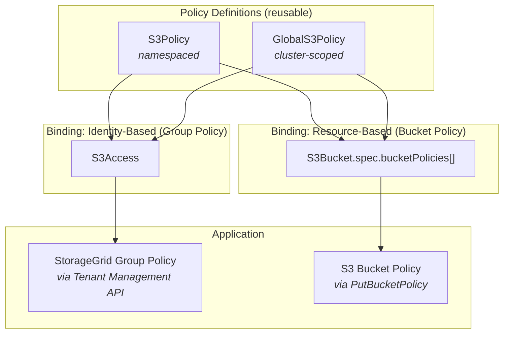

# Policy System Architecture

This document explains the S3 policy system in the StorageGrid Operator, covering the two fundamentally different policy mechanisms (identity-based and resource-based), how they are modeled as Kubernetes resources, and how the operator applies them to the StorageGrid backend.

## Overview

The operator supports two complementary S3 policy mechanisms that mirror the AWS/S3 authorization model:

| Mechanism                          | Applied To               | Controls                          | Use Case                                               |
| ---------------------------------- | ------------------------ | --------------------------------- | ------------------------------------------------------ |
| **Group Policy** (identity-based)  | StorageGrid tenant group | What a specific user/group can do | Managed user access to buckets                         |
| **Bucket Policy** (resource-based) | S3 bucket directly       | Who can access this bucket        | Anonymous access, cross-tenant grants, IP restrictions |

Both mechanisms use the same policy definition resources (`S3Policy` / `GlobalS3Policy`) but are bound and applied through different paths.



## Policy Definitions: S3Policy & GlobalS3Policy

Both resources share the same `CommonPolicySpec` and define **what** actions are allowed or denied, without specifying **who** or **which bucket**:

```yaml
apiVersion: s3.bedag.ch/v1alpha1
kind: GlobalS3Policy
metadata:
  name: read-only
spec:
  description: "Read-only access to bucket objects"
  version: "2025-01-01"
  rules:
    - effect: Allow
      actions: ["s3:GetObject", "s3:ListBucket"]
      scope: Objects
    - effect: Allow
      actions: ["s3:ListBucket"]
      scope: Bucket
```

Key design decisions:
- **No Principal** — the policy defines rules only; the consumer (S3Access or S3Bucket) provides the identity/principal context at binding time.
- **No explicit Resource ARN** — the `scope` field (`Bucket` or `Objects`) generates the ARN with a `BUCKET_NAME` placeholder, resolved at binding time by the consumer.
- **Reusable** — the same policy can be referenced by S3Access (group policy) AND S3Bucket (bucket policy) simultaneously.

### Rendering Pipeline

The S3Policy/GlobalS3Policy controllers render the spec into a JSON policy document stored in `.status.renderedPolicy`:

```
CommonPolicySpec.Rules[]
  → for each rule: map scope to ARN placeholder, build statement
  → serialize to JSON with BUCKET_NAME placeholder
  → store in status.renderedPolicy
```

Consumers (S3Access controller, S3Bucket controller) then:
1. Read `.status.renderedPolicy`
2. Substitute `BUCKET_NAME` with the actual bucket name
3. Add consumer-specific fields (Principal for bucket policies)
4. Apply to the backend

## Binding Path 1: Group Policies via S3Access

S3Access binds one or more policies to a **managed user** for a **specific bucket**:

```yaml
apiVersion: s3.bedag.ch/v1alpha1
kind: S3Access
metadata:
  name: app-reader
spec:
  s3BucketRef:
    name: my-bucket
  policyRefs:
    - kind: GlobalS3Policy
      name: read-only
  subPaths: ["data/*"]   # optional path restriction
```

### How it works

1. The S3Access controller fetches each referenced policy's `.status.renderedPolicy`
2. Parses the JSON statements, substitutes `BUCKET_NAME` with the actual bucket name
3. Optionally restricts object-scope resources to specific subPaths
4. Merges all statements into a single policy document
5. Creates a dedicated StorageGrid **group** (`<bucketName>-<accessName>`) and **user**
6. Applies the merged policy as the group's S3 policy via the Tenant Management API

### Characteristics

- **1:1 mapping**: each S3Access = one StorageGrid group + one user
- **No Principal needed**: the policy applies to the group's members (implicit)
- **Scoped to one bucket**: the `s3BucketRef` determines which bucket ARN is injected
- **Identity-based**: controls what THIS user can do

## Binding Path 2: Bucket Policies via S3Bucket.spec.bucketPolicies

Bucket policies bind one or more policies to the **bucket itself**, specifying **who** (Principal) can perform those actions:

```yaml
apiVersion: s3.bedag.ch/v1alpha1
kind: S3Bucket
metadata:
  name: public-assets
spec:
  s3TenantRef:
    name: my-tenant
  bucketPolicies:
    - policyRef:
        kind: GlobalS3Policy
        name: deny-non-tls
      # principals omitted → defaults to tenant account ID (all authenticated tenant users)
    - policyRef:
        kind: GlobalS3Policy
        name: read-only
      principals:
        - "*"                                          # anonymous access
    - policyRef:
        kind: S3Policy
        name: admin-write
      principals:
        - "arn:aws:iam::123456789012:user/deployer"   # specific identity
```

### How it works

1. The S3Bucket controller fetches each referenced policy's `.status.renderedPolicy`
2. Parses the JSON statements, substitutes `BUCKET_NAME` with the actual bucket name
3. Injects the `principals` from the binding into each statement as the `Principal` field
4. Merges all statements (from all bindings) into a single S3 bucket policy document
5. Applies via the S3 API (`PutBucketPolicy`)
6. Tracks the applied state via a fingerprint in `status.lastAppliedBucketPolicies` for drift detection

### Characteristics

- **Resource-based**: controls who can access THIS bucket
- **Principal defaults to tenant ID**: when omitted, applies to all authenticated users in the bucket's tenant (the bare tenant account ID, e.g. `"27233906934684427525"`)
- **Explicit principals for specific grants**: use `"*"` for anonymous, tenant ID for all tenant users, or ARNs for specific users/groups
- **Merges into one document**: S3 allows only one bucket policy per bucket; all bindings merge into a single JSON document
- **Applies to all requesters**: bucket policies are evaluated for every request, regardless of the caller's group policies

### Use cases only bucket policies can serve

- **Anonymous/public access**: `Principal: "*"` — no group can represent "everyone"
- **Cross-tenant access**: granting access to identities outside the operator's managed groups
- **Bucket-wide restrictions**: deny non-TLS, IP-based restrictions enforced regardless of user identity
- **External integrations**: granting access to external services by ARN

## Policy Evaluation (StorageGrid/S3 Standard)

StorageGrid follows standard S3 policy evaluation:

1. If **any** policy (group or bucket) has an explicit **Deny** → request is denied
2. If the **bucket policy** grants access (Allow + matching Principal) → request is allowed
3. If the **group policy** grants access (Allow) for same-account users → request is allowed
4. Otherwise → implicit deny

Both mechanisms are complementary. A managed user with a group policy (via S3Access) can additionally be restricted or granted access by a bucket policy (via `bucketPolicies`).

## Deprecation: BucketPolicyJson

The `spec.bucketPolicyJson` field on S3Bucket is **deprecated** in favor of the structured `spec.bucketPolicies` field:

| Aspect          | `bucketPolicyJson` (deprecated) | `bucketPolicies` (preferred)              |
| --------------- | ------------------------------- | ----------------------------------------- |
| Format          | Raw JSON string                 | Structured Kubernetes spec                |
| Validation      | None (applied as-is)            | Webhook validated, schema enforced        |
| Reusability     | Copy-paste between buckets      | References shared S3Policy/GlobalS3Policy |
| Principal       | Embedded in JSON                | Explicit field at binding level           |
| Drift detection | String comparison               | Fingerprint-based                         |

The two fields are **mutually exclusive** — setting both is rejected by the validating webhook. `BucketPolicyJson` remains functional for backward compatibility but emits a deprecation warning event during reconciliation.

## Technical Implementation Details

### grid.PolicyStatement

The shared statement type supports both group and bucket policy rendering:

```go
type PolicyStatement struct {
    Effect    string           `json:"Effect"`
    Action    []string         `json:"Action"`
    Resource  []string         `json:"Resource"`
    Principal *PolicyPrincipal `json:"Principal,omitempty"` // only set for bucket policies
}
```

For **group policies** (S3Access): `Principal` is nil and omitted from serialization — group policies don't use Principal.

For **bucket policies** (S3Bucket.bucketPolicies): `Principal` is populated from the binding's `principals` field.

### Render Pipeline Comparison

```
┌─────────────────────────────────────────────────────────────────────────────┐
│ S3Policy/GlobalS3Policy Controller                                          │
│   CommonPolicySpec.Rules → grid.PolicyStatement[] → JSON (BUCKET_NAME)     │
│   Stored in: .status.renderedPolicy                                         │
└───────────────────────────────┬─────────────────────────────────────────────┘
                                │
                ┌───────────────┴───────────────┐
                │                               │
    ┌───────────▼───────────┐       ┌───────────▼───────────┐
    │ S3Access Controller   │       │ S3Bucket Controller   │
    │                       │       │                       │
    │ 1. Parse statements   │       │ 1. Parse statements   │
    │ 2. Replace BUCKET_NAME│       │ 2. Replace BUCKET_NAME│
    │ 3. Apply subPaths     │       │ 3. Inject Principals  │
    │ 4. Merge into one doc │       │ 4. Merge into one doc │
    │ 5. Apply to GROUP     │       │ 5. Apply to BUCKET    │
    │    (Mgmt API)         │       │    (PutBucketPolicy)  │
    └───────────────────────┘       └───────────────────────┘
```

### Watch & Reconciliation Triggers

The S3Bucket controller watches `S3Policy` and `GlobalS3Policy` resources. When a referenced policy's `.status.renderedPolicy` changes, all buckets referencing that policy are re-reconciled to apply the updated content.

Similarly, the S3Access controller watches both policy types and re-reconciles affected S3Access resources when policies change.
