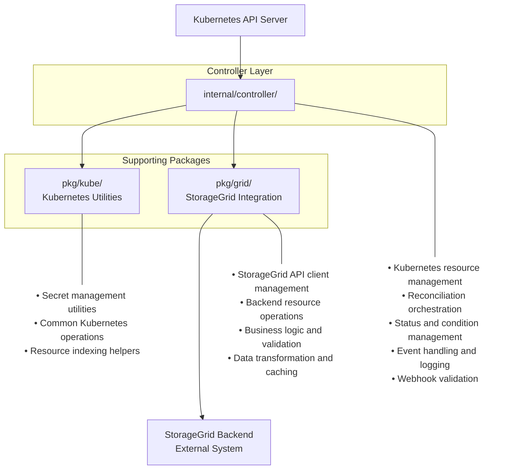
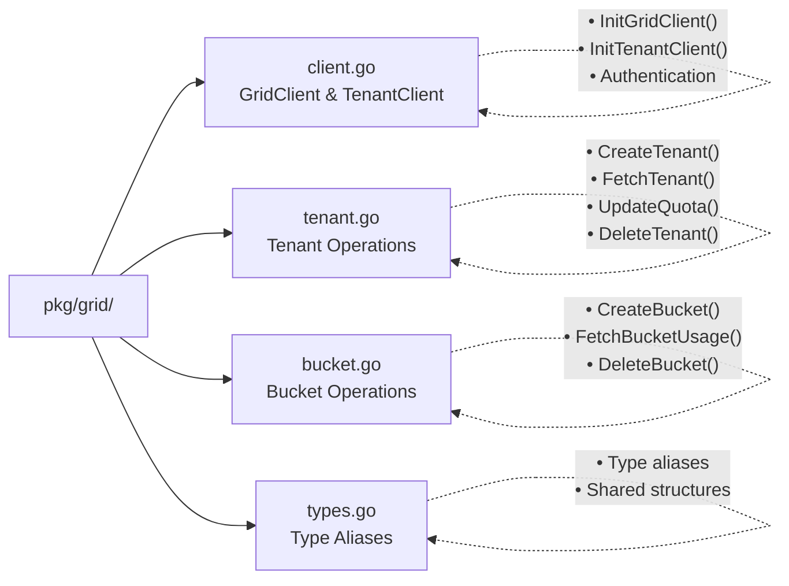
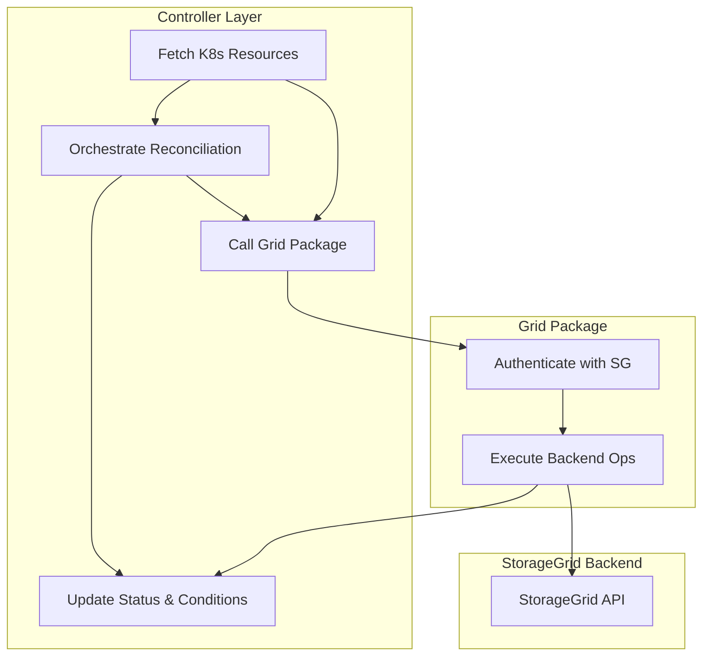
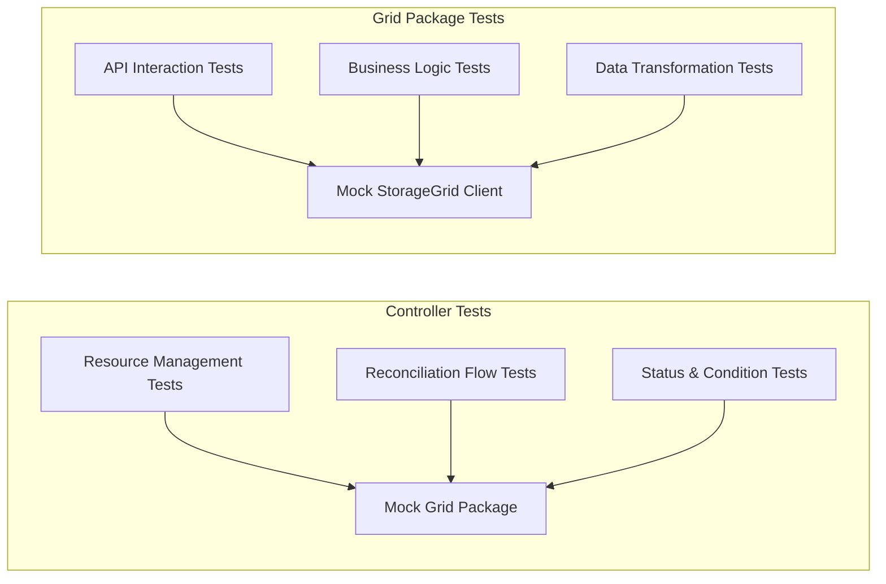

# Separation of Concerns: Controllers vs Grid Package

This document explains the architectural separation between the Kubernetes controller logic (`internal/controller/`) and the StorageGrid backend interaction logic (`pkg/grid/`), providing clear guidelines for where different types of logic should reside.

## Overview

The StorageGrid Operator follows a clean separation of concerns pattern that divides responsibilities between two main layers:

- **Controller Layer** (`internal/controller/`): Kubernetes-native operations and orchestration
- **Grid Package** (`pkg/grid/`): StorageGrid backend API interactions and business logic

This separation ensures maintainability, testability, and clear boundaries between Kubernetes operations and StorageGrid-specific functionality.

## Architecture Layers



## Controller Layer (`internal/controller/`)

### Responsibilities

The controller layer is responsible for **Kubernetes-native operations** and **orchestration logic**:

#### ✅ What Controllers Should Handle

1. **Kubernetes Resource Management**
   ```go
   // Fetching and managing Kubernetes resources
   if err := r.Get(ctx, req.NamespacedName, rctx.Account); err != nil {
       return ctrl.Result{}, client.IgnoreNotFound(err)
   }
   
   // Updating Kubernetes resource status
   if err := r.Status().Update(ctx, rctx.Account); err != nil {
       return ctrl.Result{}, err
   }
   ```

2. **Reconciliation Orchestration**
   ```go
   func (r *S3TenantAccountReconciler) doReconcile(ctx context.Context, rctx *accountReconcileContext) error {
       // Orchestrate the reconciliation flow
       if err := r.reconcileStorageGrid(ctx, rctx); err != nil {
           return err
       }
       
       if err := r.reconcileBackendTenant(ctx, rctx); err != nil {
           return err
       }
       
       return r.reconcileCredentials(ctx, rctx)
   }
   ```

3. **Status and Condition Management**
   ```go
   // Setting conditions based on reconciliation results
   r.setCondition(rctx.Account, s3v1alpha1.ConditionTypeReady, metav1.ConditionTrue, 
       "TenantReady", "Tenant is ready for use")
   ```

4. **Cross-Resource Relationships**
   ```go
   // Managing relationships between Kubernetes resources
   func (r *S3TenantAccountReconciler) reconcileStorageGrid(ctx context.Context, rctx *accountReconcileContext) error {
       storageGridKey := types.NamespacedName{Name: rctx.Account.Spec.StorageGridRef.Name}
       if err := r.Get(ctx, storageGridKey, rctx.SG); err != nil {
           return fmt.Errorf("failed to get StorageGrid: %w", err)
       }
       return nil
   }
   ```

5. **Event Handling and Logging**
   ```go
   log := log.FromContext(ctx).WithValues("s3tenantaccount", req.NamespacedName)
   log.V(1).Info("Starting reconciliation")
   ```

6. **Finalizer Management**
   ```go
   func (r *S3TenantAccountReconciler) reconcileFinalizerAndDelete(ctx context.Context, rctx *accountReconcileContext) error {
       if rctx.Account.DeletionTimestamp != nil {
           return r.finalize(ctx, rctx)
       }
       
       if !controllerutil.ContainsFinalizer(rctx.Account, FinalizerName) {
           controllerutil.AddFinalizer(rctx.Account, FinalizerName)
           rctx.ObjectUpdated = true
       }
       
       return nil
   }
   ```

#### ❌ What Controllers Should NOT Handle

1. **Direct StorageGrid API Calls**
2. **Backend-specific Business Logic**
3. **Data Format Conversions**
4. **StorageGrid Authentication Details**
5. **Backend Resource State Management**

### Controller Structure

Each controller follows this standard structure:

```go
// internal/controller/s3tenantaccount_controller.go

type S3TenantAccountReconciler struct {
    client.Client
    Scheme *runtime.Scheme
}

type accountReconcileContext struct {
    Account       *s3v1alpha1.S3TenantAccount
    SG            *s3v1alpha1.StorageGrid
    TenantClass   *s3v1alpha1.S3TenantClass
    DoRequeue     bool
    ObjectUpdated bool
    
    // Backend clients (initialized by controller)
    GridClient   *grid.GridClient
    TenantClient *grid.TenantClient
    
    // Backend data (fetched via grid package)
    BackendTenant      *models.Tenant
    BackendTenantUsage *models.TenantUsage
}

// Main reconciliation entry point
func (r *S3TenantAccountReconciler) Reconcile(ctx context.Context, req ctrl.Request) (ctrl.Result, error)

// Business logic orchestration
func (r *S3TenantAccountReconciler) doReconcile(ctx context.Context, rctx *accountReconcileContext) error

// Individual reconciliation steps
func (r *S3TenantAccountReconciler) reconcileStorageGrid(ctx context.Context, rctx *accountReconcileContext) error
func (r *S3TenantAccountReconciler) reconcileBackendTenant(ctx context.Context, rctx *accountReconcileContext) error
```

## Grid Package (`pkg/grid/`)

### Responsibilities

The grid package handles **StorageGrid backend interactions** and **domain-specific business logic**:

#### ✅ What Grid Package Should Handle

1. **StorageGrid API Client Management**
   ```go
   // pkg/grid/client.go
   func InitGridClient(username, password, endpoint string) (*GridClient, error) {
       client := &GridClient{
           httpClient: &http.Client{Timeout: 30 * time.Second},
           endpoint:   endpoint,
           username:   username,
           password:   password,
       }
       
       return client, client.authenticate(ctx)
   }
   ```

2. **Backend Resource Operations**
   ```go
   // pkg/grid/tenant.go
   func CreateTenant(ctx context.Context, request *TenantRequest, gridClient *GridClient) (*Tenant, error) {
       log := log.FromContext(ctx).WithValues("func", "CreateTenant")
       
       tenant := &models.Tenant{
           Name:        &request.Name,
           Description: &request.Description,
           Policy: &models.TenantPolicy{
               QuotaObjectBytes: &request.QuotaBytes,
           },
       }
       
       return gridClient.Tenant.Create(ctx, tenant)
   }
   ```

3. **Data Transformation and Validation**
   ```go
   // pkg/grid/tenant.go
   func GetConfiguredQuota(tenant *Tenant) int64 {
       if tenant.Policy != nil && tenant.Policy.QuotaObjectBytes != nil {
           return *tenant.Policy.QuotaObjectBytes
       }
       return 0
   }
   
   func UpdateQuota(ctx context.Context, quota int64, tenant *Tenant, gridClient *GridClient) error {
       if quota < GetConfiguredQuota(tenant) {
           return fmt.Errorf("quota can only be increased, current: %d, requested: %d", 
               GetConfiguredQuota(tenant), quota)
       }
       
       tenant.Policy.QuotaObjectBytes = &quota
       return updateTenant(ctx, tenant, gridClient)
   }
   ```

4. **Context-Based Caching**
   ```go
   // pkg/grid/tenant.go
   func FetchTenant(ctx context.Context, tenantID string, gridClient *GridClient) (*Tenant, error) {
       // Check if tenant is already in context
       if cachedTenant := ctx.Value(tenantKey); cachedTenant != nil {
           if t, ok := cachedTenant.(*models.Tenant); ok && t.Id == tenantID {
               return t, nil
           }
       }
       
       // Fetch from backend and cache
       tenant, err := gridClient.Tenant.GetById(ctx, tenantID)
       if err != nil {
           return nil, err
       }
       
       ctx = context.WithValue(ctx, tenantKey, tenant)
       return tenant, nil
   }
   ```

5. **Business Logic and Domain Rules**
   ```go
   // pkg/grid/bucket.go
   func CreateBucket(ctx context.Context, name string, region string, retentionInDays int32, tenantClient *TenantClient) error {
       bucket := models.Bucket{
           Name:   name,
           Region: region,
       }
       
       // Apply retention settings if configured
       if retentionInDays > 0 {
           enabled := true
           bucket.S3ObjectLock = &models.BucketS3ObjectLockSettings{
               Enabled: &enabled,
               DefaultRetentionSetting: &models.BucketS3ObjectLockDefaultRetentionSettings{
                   Mode: "compliance",
                   Days: retentionInDays,
               },
           }
       }
       
       _, err := tenantClient.Bucket.Create(ctx, &bucket)
       return err
   }
   ```

#### ❌ What Grid Package Should NOT Handle

1. **Kubernetes Resource Operations**
2. **Status Condition Management**
3. **Finalizer Logic**
4. **Cross-Resource Kubernetes Relationships**
5. **Controller Reconciliation Flow**

### Grid Package Structure



## Utility Layer (`pkg/kube/`)

### Responsibilities

The utility layer provides **reusable Kubernetes operations** that are not specific to any controller:

```go
// pkg/kube/secret.go
func CreateSecret(ctx context.Context, client client.Client, namespace, name string, data map[string][]byte) error
func FetchCredentialsFromSecret(ctx context.Context, client client.Client, namespace, name string) (string, string, error)

// pkg/kube/utils.go
func GetOperatorNamespace() string
func BuildSecretName(baseName, suffix string) string
```

## Interaction Patterns

### Controller → Grid Package Flow

```go
// Controller orchestrates and delegates to grid package

func (r *S3TenantAccountReconciler) reconcileBackendTenant(ctx context.Context, rctx *accountReconcileContext) error {
    // Controller handles Kubernetes concerns
    if rctx.Account.Status.TenantID != "" {
        // Tenant exists, fetch current state
        var err error
        if rctx.BackendTenant, err = grid.FetchTenant(ctx, rctx.Account.Status.TenantID, rctx.GridClient); err != nil {
            if err.Error() == grid.ErrTenantNotFound {
                // Handle missing tenant
                rctx.Account.Status.TenantUsage.BucketCount = 0
                rctx.Account.Status.TenantUsage.ObjectCount = 0
            }
            return fmt.Errorf("failed to fetch tenant: %w", err)
        }
        return nil
    }
    
    // Tenant doesn't exist, create it
    tenantRequest := &grid.TenantRequest{
        Name:        rctx.Account.Name,
        Description: buildTenantDescription(rctx.Account),
        QuotaBytes:  rctx.Account.Spec.Quota.QuotaObjectBytes,
    }
    
    // Delegate to grid package for backend operations
    tenant, err := grid.CreateTenant(ctx, tenantRequest, rctx.GridClient)
    if err != nil {
        return fmt.Errorf("failed to create tenant: %w", err)
    }
    
    // Controller updates Kubernetes state
    rctx.BackendTenant = tenant
    rctx.Account.Status.TenantID = tenant.Id
    
    return nil
}
```

### Data Flow



## Guidelines for New Developers

### When Adding New Functionality

#### Add to Controller Layer (`internal/controller/`) When:

- ✅ Managing Kubernetes resource lifecycle
- ✅ Implementing reconciliation orchestration
- ✅ Setting status conditions
- ✅ Managing finalizers
- ✅ Handling cross-resource relationships
- ✅ Implementing webhook validation

#### Add to Grid Package (`pkg/grid/`) When:

- ✅ Implementing new StorageGrid API operations
- ✅ Adding business logic for backend resources
- ✅ Creating data transformation functions
- ✅ Implementing caching mechanisms
- ✅ Adding validation for backend constraints

#### Add to Utility Package (`pkg/kube/`) When:

- ✅ Creating reusable Kubernetes operations
- ✅ Implementing common secret management patterns
- ✅ Adding helper functions used by multiple controllers

### Code Organization Examples

#### ✅ Good Separation

```go
// Controller handles Kubernetes orchestration
func (r *S3BucketReconciler) reconcileBucketCreation(ctx context.Context, rctx *bucketReconcileContext) error {
    if rctx.Bucket.Status.BucketName != "" {
        log.V(1).Info("Bucket already created")
        return nil
    }
    
    // Delegate backend operation to grid package
    err := grid.CreateBucket(ctx, bucketName, region, retentionDays, rctx.TenantClient)
    if err != nil {
        return fmt.Errorf("failed to create bucket: %w", err)
    }
    
    // Update Kubernetes state
    rctx.Bucket.Status.BucketName = bucketName
    rctx.Bucket.Status.Phase = s3v1alpha1.PhaseReady
    
    return nil
}

// Grid package handles backend logic
func CreateBucket(ctx context.Context, name, region string, retentionInDays int32, tenantClient *TenantClient) error {
    bucket := models.Bucket{Name: name, Region: region}
    
    if retentionInDays > 0 {
        bucket.S3ObjectLock = &models.BucketS3ObjectLockSettings{/* ... */}
    }
    
    _, err := tenantClient.Bucket.Create(ctx, &bucket)
    return err
}
```

#### ❌ Poor Separation

```go
// DON'T: Backend logic mixed with controller logic
func (r *S3BucketReconciler) reconcileBucketCreation(ctx context.Context, rctx *bucketReconcileContext) error {
    // This should be in grid package
    bucket := models.Bucket{Name: bucketName, Region: region}
    
    if retentionInDays > 0 {
        bucket.S3ObjectLock = &models.BucketS3ObjectLockSettings{/* ... */}
    }
    
    _, err := rctx.TenantClient.Bucket.Create(ctx, &bucket)
    if err != nil {
        return err
    }
    
    rctx.Bucket.Status.BucketName = bucketName
    return nil
}
```

### Testing Strategy



#### Controller Tests
- Focus on Kubernetes resource management
- Mock grid package functions
- Test reconciliation orchestration
- Verify status and condition updates

#### Grid Package Tests  
- Focus on backend API interactions
- Test business logic and validation
- Use real or mocked StorageGrid clients
- Verify data transformations

## Benefits of This Architecture

### 1. **Clear Boundaries**
- Each layer has well-defined responsibilities
- Easy to understand where to add new functionality
- Reduces cognitive load for developers

### 2. **Testability**
- Controller logic can be tested independently of backend
- Grid package can be tested with mocked clients
- Clear mocking boundaries

### 3. **Maintainability**
- Changes to StorageGrid API only affect grid package
- Kubernetes changes only affect controller layer
- Minimal cross-layer dependencies

### 4. **Reusability**
- Grid package functions can be reused across controllers
- Utility functions serve multiple controllers
- Clear API boundaries

### 5. **Debugging**
- Clear separation makes issue isolation easier
- Structured logging at appropriate layers
- Explicit error boundaries

This separation of concerns ensures that the StorageGrid Operator remains maintainable, testable, and extensible as it grows in complexity and functionality.