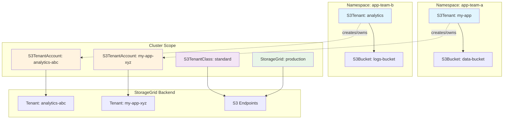
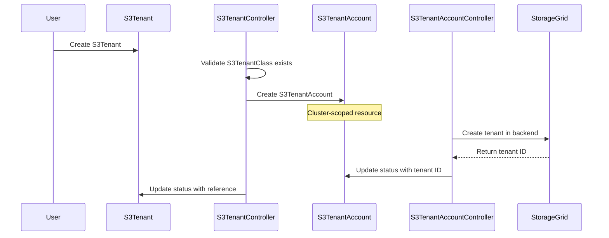
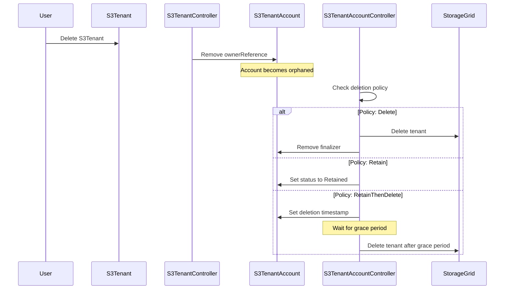

# Tenant and TenantAccount Architecture

## Overview

The StorageGrid Operator implements a two-tier tenant architecture that separates namespace-scoped tenant access from cluster-scoped tenant management. This design enables multi-tenancy while maintaining proper isolation and lifecycle management.

The design is inspired by the PV and PVC relationship and tries to mimic known patterns.

## Problem Statement

Managing S3 tenants in a Kubernetes environment presents several challenges:

1. **Multi-tenancy**: Different namespaces need isolated access to S3 resources
2. **Resource Lifecycle**: Tenant accounts in StorageGrid backend need proper lifecycle management
3. **Security**: Credentials and sensitive data must be properly scoped
4. **Operational Overhead**: Platform teams need cluster-wide visibility while application teams need namespace-local resources

## Architecture Decision

We implement a **two-tier architecture** with separate Custom Resource Definitions (CRDs):



## Components

### S3Tenant (Namespace-Scoped)

**Purpose**: Provides a namespace-local interface for application teams to request tenant access.

**Responsibilities**:
- Serve as the primary interface for namespace users
- Define tenant requirements (quota, metadata, etc.)
- Own the S3TenantAccount lifecycle
- Provide status information relevant to the namespace

**Key Fields**:
```yaml
spec:
  storageGridRef:          # Reference to StorageGrid
    name: production-sg
  s3TenantClassName: standard  # Class defining S3 endpoints
  description: "My application tenant"
  quota:
    limit: "100Gi"
  additionalTenantMetadata:
    owner: "team-alpha"
    project: "my-project"
    environment: "production"
```

### S3TenantAccount (Cluster-Scoped)

**Purpose**: Manages the actual tenant account in the StorageGrid backend.

**Responsibilities**:
- Interface directly with StorageGrid API
- Store backend tenant ID and sensitive information
- Manage tenant lifecycle (create, update, delete)
- Handle credential generation and rotation
- Provide cluster-wide tenant visibility for operators
- Handles deletion policies (Delete, Retain, RetainThenDelete)

**Key Fields**:
```yaml
spec:
  # Inherited from S3Tenant
  storageGridRef:
    name: production-sg
  s3TenantClassName: standard
  # ... other tenant configuration
  
status:
  tenantId: "12345678-1234-1234-1234-123456789012"
  observedTenantBackendName: "my-app-xyz"
  s3TenantRef:               # Back-reference to owning S3Tenant
    name: my-app
    namespace: app-team-a
  credentials:
    secretName: s3-tenant-my-app-credentials
    secretNamespace: app-team-a
```

## Lifecycle Management

### Creation Flow



### Deletion Flow

The operator supports multiple deletion policies:

1. **Delete**: Immediate deletion from backend
2. **Retain**: Keep tenant in backend, remove Kubernetes resources
3. **RetainThenDelete**: Grace period before backend deletion



## Benefits

### 1. **Separation of Concerns**

- **Application Teams**: Work with namespace-scoped S3Tenant resources
- **Platform Teams**: Manage cluster-scoped S3TenantAccount resources
- **Clear Boundaries**: Each team operates within their scope of responsibility

### 2. **Security Isolation**

- Sensitive backend credentials stored in cluster-scoped resources
- Namespace teams cannot access other tenants' account details
- RBAC can be applied at appropriate levels

### 3. **Operational Flexibility**

- Platform teams get cluster-wide visibility of all tenant accounts
- Individual tenant accounts can be managed independently
- Support for tenant migration between namespaces

### 4. **Resource Lifecycle Management**

- Clear ownership hierarchy with owner references
- Configurable deletion policies for different use cases
- Proper cleanup and garbage collection

## Design Considerations

### Owner References

S3Tenants are owned by their corresponding S3TenantAccount using Kubernetes owner references:

```yaml
# S3TenantAccount
metadata:
  ownerReferences:
  - apiVersion: s3.bedag.ch/v1alpha1
    kind: S3TenantAccount
    name: s3-tenant-12345678-1234-1234-1234-123456789012
    uid: 12345678-1234-1234-1234-123456789012
    controller: true
    blockOwnerDeletion: true
```

This ensures:
- Automatic cleanup when S3Tenant is deleted
- Clear ownership hierarchy
- Kubernetes garbage collection handles orphaned resources

### Naming Strategy

S3TenantAccount names are derived from S3Tenant uid to ensure uniqueness:

```
S3TenantAccount name = s3tenant-<s3-tenant-uid>
```

Example: `s3tenant-ef30db28-1b33-4cd3-af33-20cbccf4d7e9`

This prevents naming conflicts across namespaces while maintaining traceability.

### Status Synchronization

Both resources maintain synchronized status information:

- **S3Tenant**: Focuses on namespace-relevant status
- **S3TenantAccount**: Maintains complete backend state

## Alternative Approaches Considered

### Single Resource Model

**Approach**: Use only namespace-scoped S3Tenant resources.

**Rejected Because**:
- Platform teams lose cluster-wide visibility and operational control
- Credential management becomes complex
- RBAC boundaries are unclear
- Backend tenant lifecycle tied to namespace lifecycle
- Deletion for retained tenants gets complex and needs to be tracked on another resource

### Three-Tier Model

**Approach**: Add an intermediate S3TenantTemplate or similiar resource.

**Rejected Because**:
- Adds unnecessary complexity
- Current two-tier model addresses all requirements
- Additional abstraction layer without clear benefits

## Implementation Details

### Controller Architecture

Two separate controllers manage the resources:

1. **S3TenantController**: Manages S3Tenant lifecycle and creates S3TenantAccount
2. **S3TenantAccountController**: Manages backend tenant operations

### Cross-References

Resources maintain bidirectional references:
- S3TenantAccount → S3Tenant (via ownerReference and status.s3TenantRef)
- S3Tenant → S3TenantAccount (via status.s3TenantAccountRef)

## Monitoring and Observability

### Metrics (TODO)

The operator exposes metrics for both resource types:
- Tenant creation/deletion rates
- Account synchronization status
- Backend API call success rates

### Events (TODO)

Kubernetes events are generated for:
- Tenant account creation/deletion
- Backend synchronization issues
- Policy violations

## Future Considerations

### Advanced Lifecycle Policies

The architecture can be extended to support:
- Automated tenant archival
- Cost-based lifecycle policies
- Compliance-driven retention rules

---

This architecture provides a robust foundation for multi-tenant S3 management while maintaining clear separation of